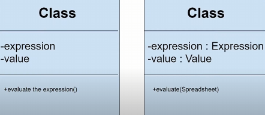
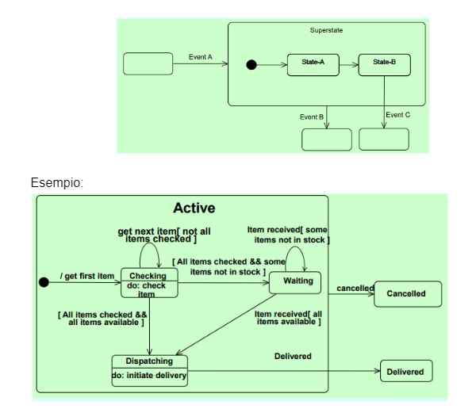
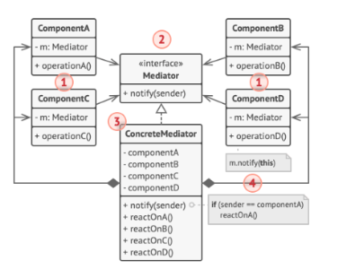
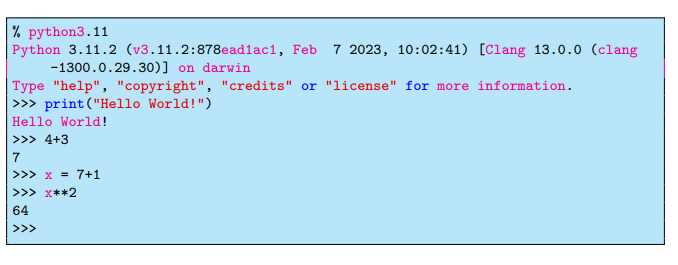
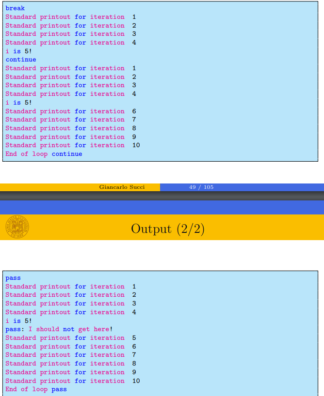
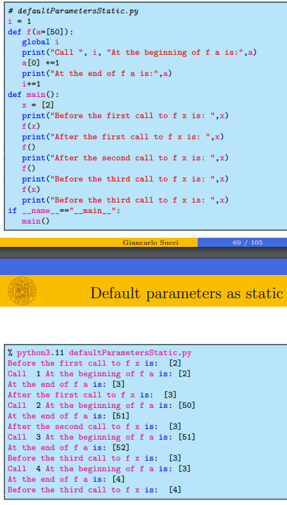
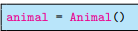
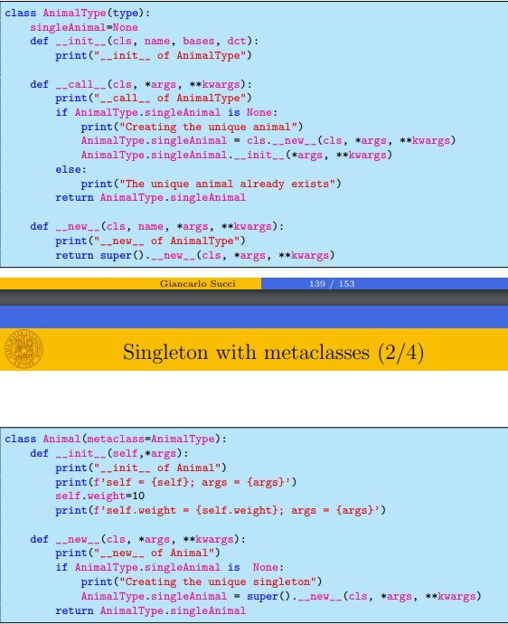

## Modulo 1
1. Quali sono le diverse categorie di software?

**Risposta:** I software si dividono in: ecosistemi di software(amazon), servizi software(google), social software(facebook), software embedded(automobili).

2. Cos’è un software, e quali sono i tipi di prodotto software

**Risposta:** Opera di ingegno, è un insieme di programmi, dati e documentazione. I tipi di prodotto software sono: generico(venduto sul mercato), commissionati(sviluppati per un cliente), servizi in perpetuo sviulppo(sviluppati per un cliente e mantenuti).

3. Requisito vs Feature

**Risposta:** Un requisito è una condizione o una capacità che il prodotto deve possedere, è importante per il cliente. Una feature è una funzionalità del software che permette l'uso del prodotto, è importante per il fornitore. 

4. Autore vs Compratore dal punto di vista legale

**Risposta:** L'autore, essendo il software opera di ingegno, ha diritto ad un compenso e le copie abusive sono illegali. Il compratore non ha garanzia sul software, in quanto i difetti non sono a carico del fabbricante. La SIAE registra le opere di ingegno, registra il trasferimento dei diritti e mantiene una dichiarazione e una descrizione oltre che un esemplare dle programma.

6. Come si calcola la produttività?

**Risposta:** La produttività si calcola come `beni prodotti / risorse utilizzate`. 

7. Perché falliscono i progetti sw?

**Risposta:** Falliscono per: mancanza di feedback, turover dello staff, sistema unisabile, ritardi di consegna.

8. Ciclo di sviluppo vs ciclo di vita

**Risposta:** Il ciclo di sviluppo è il processo di sviluppo del software, è composto da: raccolta dei requisiti, progettazione, prototipazione, testing e rilascio. Il ciclo di vita di un prodotto software è composto da: analisi e specifica dei requisiti, progettazione, codifica e debugging, testing, deployment e manutenzione.

9. Costi e processo di sviluppo

**Risposta:** I costi dominano la produzione. E' più costoso il mantenimento che lo sviluppo. 

10. Legge di brooks

**Risposta:** La legge di Brooks dice che aggiungere personale a un progetto in ritardo lo farà solo ritardare di più. 

11. Legge di conway

**Risposta:** La legge di Conway dice che le organizzazioni che producono software tendono a produrre software che rispecchia la struttura dell'organizzazione.

12. Software come prodotto sociale

**Risposta:** Molte qualità del software dipendono dalla parte sociale. Modifica i rapporti tra persone

13. Categorie di processi: programming in the many, in the small, in the large

**Risposta:** Programming in the many è il processo di sviluppo software in cui molte persone lavorano insieme su un progetto. Programming in the small è il processo di sviluppo software in cui una persona lavora da sola su un progetto. Programming in the large è il processo di sviluppo software in cui una persona lavora ad un progetto molto grande.

14. Modello a cascata

**Risposta:** Il modello a cascata è un modello di sviluppo software in cui le fasi sono svolte in sequenza, una dopo l'altra. Ogni fase deve essere completata prima di passare alla successiva. E' facile da capire e da gestire, ma non permette di adattarsi ai cambiamenti e non permette di avere un feedback continuo.

15. Modelli generici di processo sw

**Risposta:** I modelli generici di processo software sono: modello a cascata, modello iterativo, agile(non pianificato, guidato da utenti), formali(basati su regole e procedure).

16. Modello lineare vs iterativo

**Risposta:** Il modello lineare è un modello di sviluppo software in cui le fasi sono svolte in sequenza, una dopo l'altra. Ogni fase deve essere completata prima di passare alla successiva. E' facile da capire e da gestire, ma non permette di adattarsi ai cambiamenti e non permette di avere un feedback continuo. Il modello iterativo invece prevede che le fasi vengano ripetute più volte, permettendo di adattarsi ai cambiamenti e di avere un feedback continuo. E' più flessibile e permette di avere un prodotto finale più vicino alle aspettative del cliente.

17. Modello a spirale

**Risposta:** Il modello a spirale è un modello iterativo. Si sviluppa in cicli, ogni ciclo è composto da 4 fasi: determinazione degli obiettivi, valutazione e riduzione dei rischi, sviluppo e validazione, pianificazione del successivo ciclo. E' flessibile e permette di adattarsi ai cambiamenti, ma è più costoso e richiede più tempo.

18. Qualità del processo sw

**Risposta:** La qualità del processo software è discuss ain base a : visibilità(regole e artefatti noti agli stakeholders), misurabilità(qualità misurabile), precisione(descrizione precisa delle attività), ripetibilità(riproducibilità delle attività).

19. Principi agili e etica del movimento

**Risposta:** Etica del movimento: individui e interazioni > processi e strumenti, sw che funziona > documentazione completa, collaborazione col cliente > negoziazione contrattuale, reazione al cambiamento > seguire un piano.
Principi agili: \\TODO

20. MVP

**Risposta:** Il MVP(Minimum Viable Product) è il prodotto software minimo da rilasciare per soddisfare i requisiti del cliente. Serve a raccogliere feedback e a migliorare il prodotto.

21. XP e pratiche

**Risposta:** \\TODO

22. US

**Risposta:** Le User Stories sono una tecnica di scrittura dei requisiti in cui si descrive una funzionalità del software dal punto di vista dell'utente. Sono scritte in modo semplice e conciso, seguono il formato: `Come <tipo di utente> voglio poter <obiettivo> per <motivazione>. Seguono il metodo MoSCoW per la priorità: Must, Should, Could, Won't. 

23. Ciclo base di scrum

**Risposta:** Il ciclo base di scrum è composto da: arriva l’idea, poi il PO crea una lista di funzionalità(product backlog), poi ci sarà lo sprint planning meeting, dove si crea lo sprint backlog. Dopo lo sprint ci sarà una demo, una review, una retrospettiva e poi si riparte.

24. Sprint

**Risposta:** Lo sprint è l'iterzione di tempo in cui il team sviluppa il software. Dura da 1 a 4 settimane, è un periodo di tempo fisso. Estrae funzioni ready dal product backlog, le sviluppa e le testa e aggiunge codice done da consegnare al cliente.

25. Ruoli scrum

**Risposta:** I ruoli di scrum sono: Product Owner, Scrum Master, Team. Il Product Owner è il responsabile del prodotto, è il tramite tra il team e gli stakeholders. Il Scrum Master è il facilitatore del team, rimuove gli ostacoli, aiuta il team a risolvere i problemi. Il Team è il gruppo di persone che sviluppa il software, è auto-organizzato e multidisciplinare.

26. Sprint planning

**Risposta:** Lo sprint planning è una riunione. Come input ci sono il product backlog, il current product status, i vincoli e le capacità del team. Come output ci sono lo sprint goal, lo sprint backlog. Si divide in: sprint prioritization, si selezionano le US da sviluppare, e sprint planning, si decide come arrivare allos print goal e si decompongono le US in tasks.

27. Definition of ready e done

**Risposta:** La definition of ready è una lista di criteri che devono essere soddisfatti prima che una US possa essere presa in considerazione per lo sprint(la storia deve essere indipendente, stimata con un valore). La definition of done è una lista di criteri che devono essere soddisfatti prima che una US possa essere considerata completata(andrà a descrivere lo stato dell'increment).

28. Daily scrum

**Risposta:** Il daily scrum è una riunione giornaliera in cui il team si riunisce per 15 minuti per fare il punto della situazione. Ogni membro del team risponde a 3 domande: cosa ho fatto ieri, cosa farò oggi, ho problemi? Chiunque può assistere ma parlano solo i Pig(che lavorano al progetto).

29. Sprint review

**Risposta:** La sprint review è una riunione in cui il team mostra al PO il prodotto dello sprint con una demo delle nuove funzioni. Serve a verificare lo stato del product backlog.

30. Sprint retrospective

**Risposta:** La sprint retrospective è una riunione in cui il team si riunisce per fare il punto della situazione sullo sprint appena concluso. Riguarda il processo e non il prodotto, serve a identificare i problemi e a trovare soluzioni. Un metodo famoso è Start, Stop and Continue.

31. Artefatti

**Risposta:** Gli artefatti di scrum sono: product backlog, una lista dei requisiti in forma di US con adeguate priorità assegnate ad ogni feature, lo sprint goal, una lista di obiettivi da raggiungere entro la fine dello sprint, lo sprint backlog, una lista di US decomposte in tasks selezionate dal product backlog da completare entro la fine dello sprint con tanto di stima di tempo e effort, e il burndown chart, un grafico che mostra il lavoro rimanente da fare rispetto al tempo, raffigura la velocità del team.

32. Product backlog

**Risposta:** Il product backlog è una lista dei requisiti in forma di US con adeguate priorità assegnate ad ogni feature. Nella cima dell'iceberg ci sono le storie pronte per essere realizzate, subito sotto le storie previste nel pinao dei rilasci e ancora più sotto i rilasci futuri non ancora chiari.

33. Varianti di scrum

**Risposta:** Le varianti sono: team unico con molteplici PO, team multipli per un unico prodotto, scrum di scrum(metascrum degli ambasciatori)

34. Legge di humphrey

**Risposta:** La legge di Humphrey dice che i requisiti di un prodotto software non sono chiari dinchè gli utenti non lo usano. Un problema non è ben compreso finchè non si è trovata una soluzione. 

36. Requisito e forma del requisito

**Risposta:** Un requisito è una condizione o una capacità che il prodotto deve possedere, è importante per il cliente. Ci sono 3 livelli di requisiti: business(perchè il programma esiste), utente(che utenti lo useranno), software(cosa deve fare il programma). Il requisito può essere sotto forma di: epica, user story, use case, requisito funzionale.

37. Competenze del PO

**Risposta:** Il PO(Product Owner) è il responsabile del prodotto, è il tramite tra il team e gli stakeholders. Deve massimizzare il valore del prodotto, deve definire i requisiti, deve definire le priorità. E' responsabile per definire il product goal, creare il product backlog, assegnare prioritò, concordare le definizioni di done e ready.

39. Stakeholders

**Risposta:** Gli stakeholders sono le persone o le organizzazioni che hanno un interesse nel progetto. Possono essere interni o esterni. Gli stakeholders interni sono i membri del team, il PO, il SM, il cliente. Gli stakeholders esterni sono i clienti, i fornitori, i partner.

40. Backlog

**Risposta:** Il backlog è una lista di requisiti in forma di US con adeguate priorità assegnate ad ogni feature. Il product backlog è una lista di tutti i requisiti del progetto, il sprint backlog è una lista di requisiti selezionati dal product backlog da completare entro la fine dello sprint. Il Backlog grooming è il processo di aggiornamento del product backlog, riesaminando le US, le priorità e suddividendo attività complesse in più compiti, stimando il tempo e le risorse necessarie.

41. Retrospettiva, ruoli coinvolti

**Risposta:** Il PO riassume il feedback del team e del cliente, richiede suggerimenti per migliorare la performance e offre supporto. Il SM facilita il team, rimuove gli ostacoli, identifica i temi principali, ricorda i risultati e tiene traccia delle proposte. Il team definisce le priorità, identifica i problemi, propone soluzioni, si impegna a migliorare e si impegna a risolvere i problemi.

42. Essence

**Risposta:** Essence è un framework per la gestione dei progetti software. Si concentra sulle buone pratiche di sviluppo, supporta l'autoaddestramento del team. Le pratiche sono indipendneti dal metodo. E' composto da: $\\$


Scrum definito con Essence: $\\$


43. Giochi di retrospettiva

**Risposta:** Progress poker: si scelgono delle carte alpha, si dà una valutazione di progresso e se la valutazione differisce si argomenta col team il motivo. Chase the state: si disegna una linea del tempo e si mettono i progressi. Good Mad Sad: si scrivono le cose buone, cattive e tristi, annotando come migliorare. 

44. Principi INVEST

**Risposta:** I principi INVEST sono: Independent, Negotiable, Valuable, Estimable, Small, Testable. Le US devono essere indipendenti, negoziabili, di valore(per gli stakeholders), stimabili(in termini di costo), piccole e testabili.

45. US orizzontali e verticali

**Risposta:** Gli sviluppatori scrvino di solito il backlog orizzontalmente, in modo da poter riusare le funzionalità dei piani inferiori. Si preferisce però scriverle verticalmente in quanto permettono di impacchettare funzionalità senza dipendenze e consegnarle rapidamente per avere un feedback continuo.

46. Requisiti

**Risposta:** I documenti dei requisiti sono: User Stories, Use case, Prototipi e Mockup.

47. Casi d’uso vs US

**Risposta:** I casi d'uso definiscono chi vuole cosa dal prodtto, in qualche contesto(scenario). Le US definiscono chi, cosa e perchè di una funzione del prodotto. Le prime hanno una descrizione più dettagliata, le seconde sono più semplici e veloci da scrivere.

49. Tipi di attori

**Risposta:** Nei diagrammi dei casi d'uso ci sono: attori di business(indipendenti da soluzioni software), attori di servizio(dipendenti da soluzioni software).

50. Project manager

**Risposta:** Il project manager è il responsabile del progetto, è responsabile per la pianificazione, l'organizzazione, il controllo e il coordinamento del progetto. Deve assicurarsi che il progetto venga completato in tempo, entro il budget e con la qualità richiesta. Alla fine confronta preventivo e consuntivo. 

51. Work breakdown taiga

**Risposta:** Il work breakdown è il processo di suddivisione del progetto in attività più piccole, più facili da gestire e da monitorare. Si può utilizzare Taiga, uno strumento di project management che permette di creare un work breakdown, di assegnare le attività ai membri del team, di monitorare il progresso del progetto e di generare report.

52. Cono delle incertezze

**Risposta:** Il cono delle incertezze è un grafico che rappresenta il livello di incertezza del progetto nel tempo. 

53. Valore, produttività, costo, debito tecnico

**Risposta:** Il valore è il numero di utenti * ricavi per utente. Il costo è calcolato in mesi/persona. La produttività è il rapporto tra la grandezza del progetto e lo sforzo. Il debito tecnico è il costo di riparare un errore in futuro. In un buon progetto il valore è molto maggiore del costo sommato al debito tecnico.

54. Misure di dimensioni del progetto

**Risposta:** Ci sono 3 tipi di misure: line of code, function point, punti-storia(nei processi agili). Le misure hanno bisogno di essere calibrate con dati storici.

55. LoC

**Risposta:** Le linee di codice sono una misura della grandezza del progetto. Sono una misura semplice e veloce, ma non sono precise e non tengono conto della complessità del codice.

56. FP

**Risposta:** I function point sono una misura della grandezza del progetto. Sono una misura più precisa delle linee di codice, tengono conto della complessità del codice e del numero di funzionalità. Si calcolano in base a 5 parametri: inputs, outputs, inquiries, files, interfaces.

57. COCOMO

**Risposta:** Il COCOMO è un modello di stima dei costi di sviluppo del software. Si basa su 3 livelli: basic(inizio del progetto), intermediate(dopo la specifica dei requisiti), advanced(dopo la progettazione). Ci possono essere 3 tipi di progetti: organici(team piccolo), semi-detached(team medio), embedded(requisiti vincolanti in campo poco conosciuto). L'equazione è: `performance = complexity^process * team * tools`.

58. Bug

**Risposta:** Un bug è un errore nel software che causa un comportamento inaspettato. Secondo la definizione IEEE: un error è la causa di un difetto, un difetto è un'anomalia nel software, un fallimento è un comportamento inaspettato. Un programmatore esperto fa 1 errore ogni 10 righe di codice, 50% di essi vengono risolti a compilazione, 15% esistono ancora al tempo della consegna.

59. Qualità del prodotto sw

**Risposta:** La qualità del software è la conformità ai requisiti e alle aspettative del cliente. I test garantiscono la qualità, qualsiasi codice senza test è considerato difettoso. La qualità può essere funzionale, valutato tramite testing, o strutturale, valutato tramite validazione. Gli attributi di qualità di un prodotto sono: caratteristiche operative, adattabilità, manutenibilità, usabilità, efficienza, affidabilità, portabilità.

60. Tom deMarco

**Risposta:** Tom DeMarco dice che non puoi controllare ciò che non puoi misurare. La qualità del software è difficile da misurare, ma è importante per il successo del progetto. 

61. Goal Question Metric

**Risposta:** Il Goal Question Metric è un metodo di definizione delle metriche di qualità del software. Si parte dai goal, si definiscono le domande, si definiscono le metriche. E' un metodo top-down, si parte dagli obiettivi e si scende ai dettagli.


62. Testing

**Risposta:** Il testing è una parte importante sel processo software, serve a verificare che il software funzioni correttamente seguendo i requisiti. Esistono testing di unità, di modulo(componenti correlati), sottosistemi(moduli correlati), sistema e accettazione(da parte del cliente). Si pianifica il testing in base al rischio, si esegue il testing e si valuta il risultato.

63. Metodi di testing

**Risposta:** I metodi di testing sono: testing diretto, automatico, di basso livello che controlla solo funzionalità di base, o indiretto, manuale, di alto livello che controlla scenari realistici

64. Black box vs white box

**Risposta:** Il black box testing è un tipo di testing in cui il tester non conosce l'implementazione del software, si basa sui requisiti, testa le interfacce. Il white box testing è un tipo di testing in cui il tester conosce l'implementazione del software, testa la logica interna del software e e singole funzioni. I tipi di white box testing sono: statement coverage(ogni comando viene eseguito almeno una volta), branch coverage(ogni branch viene eseguito almeno una volta, testa le condizioni), path coverage(ogni percorso viene eseguito almeno una volta

65. Toerema di Weyuker

**Risposta:** Il teorema di Weyuker dice che dato un genercio programma è indicibile l'esistenza di un input che causerà l'esecuzione di un particolare comando, condizione o cammino).

66. Sviluppo guidato dal testing

**Risposta:** Il TDD(Test Driven Development) è un metodo di sviluppo software in cui si scrivono i test prima di scrivere il codice. Test rosso: funziona vuota, fallisce perchè non esiste. test verde: codice necessario per passare il test rosso. Refactoring: migliorare il codice del test verde(Questo è il ciclo del TDD). Il metodo XP è TDD.

67. Fault injection

**Risposta:** Miglioramento del coverage introducendo errori nel codice per vedere se i test li rilevano.

68. Sonarqube

**Risposta:** SonarQube è uno strumento di testing statico per il codice sorgente. Analizza il codice sorgente per trovare errori e vulnerabilità, e fornisce un report dettagliato con i risultati. E' utile per migliorare la qualità del codice e per trovare errori prima che il software venga rilasciato.

69. Evoluzione del sw

**Risposta:** L'evoluzione del software è il processo di avanzamento del software nel tempo. Il software deve essere mantenuto e aggiornato per soddisfare i requisiti del cliente. 

70. Tipi di manutenzione

**Risposta:** I tipi di manutenzione sono: preventiva(identificare e risolvere i problemi prima che si verifichino), correttiva(risolvere i problemi dopo che si sono verificati), adattativa(adattare il software ai cambiamenti dell'ambiente), perfectiva(migliorare il software per soddisfare i requisiti del cliente) e di emergenza(risolvere i problemi critici).

72. Complessità ciclomatica

**Risposta:** La complessità ciclomatica è una misura della complessità del codice. Si calcola contando il numero di cammini indipendenti attraverso il grafo di controllo del flusso del programma. Un valore alto di complessità ciclomatica indica un codice complesso e difficile da testare.

73. Metriche di manutenibilità

**Risposta:** La manutenibilità è la capacità di un software di essere modificato e aggiornato. Interna: dipende da caratteristiche del sistema, esterna: dipende dall'ambiente.

## Modulo 2
75. Moduli: coupling, coesione, semplicità

**Risposta:** Il coupling è il grado di dipendenza tra i moduli, un coupling basso è preferibile. La coesione è il grado di correlazione tra le funzionalità di un modulo, una coesione alta è preferibile. La semplicità è la facilità di comprensione di un modulo, una semplicità alta è preferibile.

76. UML

**Risposta:** UML(Unified Modeling Language) è un linguaggio di modellazione per il software. E' un linguaggio standard, è indipendente dal linguaggio di programmazione, è un linguaggio grafico e permette di descrivere il software in modo chiaro e preciso. E' composto da 13 diagrammi, divisi in 2 categorie: diagrammi strutturali e diagrammi comportamentali.

77. Classi

**Risposta:** Una classe è un modello astratto di un oggetto, contiene attributi e metodi. Gli attributi sono le caratteristiche dell'oggetto, i metodi sono le azioni che l'oggetto può compiere. *Ereditarietà*: una classe può ereditare attributi e metodi da un'altra classe. *Polimorfismo*: una classe può avere più metodi con lo stesso nome, ma con parametri diversi. *Polimorfismo ad hoc*: una sotto-classe può chiamare una funzione della super-classe con parametri diversi(overloading). *Polimorfismo generico*: un template generico definisce una struttura comune per più classi. *Polimorfismo ereditario*: una classe può sovrascrivere un metodo della super-classe(overriding). L'iterative refinement è un processo in cui si aggiungono iterativamente classi sempre più specializzate.

78. 13 tipi di diagrammi

**Risposta:** I 13 tipi di diagrammi UML sono: diagrammi strutturali divisi in class diagram, object diagram, component diagram, composite structure diagram, package diagram, deployment diagram, diagrammi comportamentali divisi in use case diagram, activity diagram, state chart diagram, sequence diagram, communication diagram, interaction overview diagram, timing diagram.


79. OO concept modeling, OO analysis

**Risposta:** L'OO concept modeling è il processo di identificazione dei requisiti del software e di modellazione del software in modo da soddisfare i requisiti(use case). L'OO analysis è il processo di progettazione del software in modo da soddisfare i requisiti, si traduce il modello concettuale in un modello di progettazione.

81. Ereditarietà virtuale

**Risposta:** L'ereditarietà virtuale è un tipo di ereditarietà multipla in cui una classe può ereditare da più classi, ma solo una classe base può essere ereditata virtualmente.

82. OOA to OOD

**Risposta:** OOA(Object Oriented Analysis) è il processo di identificazione dei requisiti del software e di modellazione del software in modo da soddisfare i requisiti(use case). OOD(Object Oriented Design) è il processo di progettazione del software in modo da soddisfare i requisiti, si traduce il modello concettuale in un modello di progettazione. Da classi a classi+oggetti, da attributi a tipi di dati, da operazioni a metodi, da associazioni a links+messages, da behavior a control.

200. Livelli di specificazione

**Risposta:** I livelli di specificazione sono: concettuale, specifica, implementativa. Il livello concettuale è il più alto, descrive il sistema in modo astratto. Il livello specifica è il livello intermedio, descrive il sistema in modo dettagliato. Il livello implementativo è il livello più basso, descrive il sistema in modo concreto. $\\$




83. Class diagram

**Risposta:** $\\$


84. Use case diagram

**Risposta:** $\\$


85. Statechart diagram

**Risposta:** $\\$



86. Activity diagram

**Risposta:** $\\$


87. Sequence diagram

**Risposta:** $\\$


88. Collaboration diagram

**Risposta:** $\\$


89. Package diagram

**Risposta:** $\\$


90. Components diagram 

**Risposta:** $\\$


91. System e sub-system

**Risposta:**$\\$


92. Real time system analysis and design

**Risposta:** Ci sono due feature di UML che supportano le applicazioni a real time: time events e time constraints. Time events sono eventi che si verificano in un momento specifico, time constraints sono vincoli temporali che devono essere rispettati.


93. ROOM

**Risposta:** ROOM(Real-time Object-Oriented Modeling) è un linguaggio di modellazione per i sistemi real-time. Si basa su UML, ma è più specifico per i sistemi real-time. Ci sono le istanze incapsulate.

94. OCL

**Risposta:** OCL(Object Constraint Language) è un linguaggio di specifica per i modelli UML. Serve a definire vincoli e regole per i modelli UML. E' un linguaggio dichiarativo, non procedurale, che permette di definire vincoli su classi, attributi, operazioni e relazioni. Immette condizioni pre e post statement(se mangi peserai di più), le associazioni con cardinalità 1 sono viste come attributi, il resto come insiemi. //Da cercare qualcosa di più preciso

95. Refactoring

**Risposta:** Il refactoring è il processo di miglioramento del design del software senza modificarne il comportamento. Si fa per rendere il codice più leggibile, più facile da manutenere e più efficiente. Le modalità di refactoring sono: breakdown/condense, re-qualify, utilizzo di design patterns, eliminazione di entità troppo grandi.

96. Approccio gamma

**Risposta:** L'approccio gamma è un approccio di sviluppo software in cui si utilizzano i design patterns per risolvere i problemi comuni. I design patterns sono soluzioni a problemi ricorrenti, sono modelli di progettazione che possono essere riutilizzati in diversi contesti. I design patterns sono divisi in 3 categorie: creazionali, strutturali, comportamentali.

98. Garland and shaw

**Risposta:** Garland and Shaw hanno identificato 7 tipi di architetture software: pipes e filtri, ADT, layered system, event-based implicit invocation, repositories, interpreters, repository centrale.

99. Pipes e filtri

**Risposta:** Pipes e filtri è un tipo di architettura software in cui i dati vengono trasformati da un filtro localmente, i filtri sono indipendenti e possono essere riutilizzati. I filtri sono collegati da tubi, i dati vengono trasformati da un filtro all'altro. 

100. ADT

**Risposta:** ADT(Abstract Data Type) è un tipo di architettura software in cui i dati sono astratti e indipendenti dall'implementazione. Gli ADT sono composti da dati e operazioni, i dati sono nascosti e accessibili solo tramite le operazioni.

101. Layered system

**Risposta:** Un layered system è un tipo di architettura software in cui i moduli sono organizzati in layer, ogni layer ha un compito specifico. I layer comunicano tra loro attraverso interfacce, i layer più interni sono a conoscenza dei layer più esterni, ma non viceversa. 

102. Event-based implicit invocation

**Risposta:** L'event-based implicit invocation è un tipo di architettura software in cui i moduli comunicano tra loro attraverso eventi. Un modulo invia un evento, gli altri moduli che sono in grado di gestire l'evento lo ricevono e lo processano. 

103. Repositories

**Risposta:** Un repository è un tipo di architettura software in cui i dati sono memorizzati in un repository centrale, i moduli accedono ai dati attraverso il repository. Il repository è responsabile per la gestione dei dati, i moduli non sono a conoscenza della struttura dei dati. Blackboard è un tipo di repository in cui i moduli scrivono e leggono i dati dal repository.

104. Interpreters

**Risposta:** Un interprete è un tipo di architettura software in cui i moduli interpretano i dati e producono un output. Gli interpreti sono indipendenti e possono essere riutilizzati.

105. Repository centrale

**Risposta:** Un repository centrale è un tipo di architettura software in cui i dati sono memorizzati in un repository centrale. Le applicazioni client permettono di accedere ai dati attraverso il repository. 

106. Client server

**Risposta:** Il client server è un tipo di architettura software in cui i moduli sono divisi in client e server. Il client richiede i dati al server, il server elabora i dati e li invia al client. Il client è responsabile per l'interfaccia utente, il server è responsabile per l'elaborazione dei dati.

107. inter/intra net

**Risposta:** Un intranet è una rete privata che permette ai dipendenti di un'organizzazione di condividere informazioni e risorse. Un internet è una rete pubblica che permette a tutti di accedere alle informazioni e alle risorse.

108. n tiers architectures

**Risposta:** Un'architettura a n tier è un tipo di sistema client/server distribuito in cui i moduli sono divisi in n tier. Ogni tier ha un compito specifico, i tier comunicano tra loro attraverso interfacce. I tier più interni sono a conoscenza dei tier più esterni, ma non viceversa.

109. layered architecture

**Risposta:** Una architettura a layer è composta da layer che comunicano tra loro, due servizi possono accedere l'uno all'altro solo se sono dello stesso layer. I livelli più interni non sono a conoscenti dei livelli più esterni. Questo permette di avere un sistema più modulare e facile da manutenere. I layer interni fanno operazioni simili a istruzioni macchina, quelli intermedi fanno operazioni di alto livello e quelli esterni interagiscono con l'utente.

110. network architecture

**Risposta:** Un'architettura di rete è un tipo di architettura che definisce i layer e i protoccoli per scambiare informazioni(OSI o TCP/IP). 

111. architettura parallela

**Risposta:** Un'architettura parallela è un tipo di architettura in cui i calcoli sono distribuiti su più processori che lavorano alla stessa task.

112. Grid computing

**Risposta:** Grid computing è un tipo di architettura parallela in cui i calcoli sono distribuiti su più macchine, che possono essere fisicamente separate. Ogni macchina ha un compito specifico, che viene eseguito in parallelo con gli altri. E' utile per i calcoli che richiedono molta potenza di calcolo, come il calcolo di grandi quantità di dati.

113. Controllo centralizzato

**Risposta:** Il controllo centralizzato è un tipo di controllo in cui un singolo modulo controlla tutti gli altri moduli che sono passivi. Ci sono due principali modelli: *call and return*, il modulo chiama funzioni dei livelli più bassi iterativamente, il programma finisce quando il modulo principale ritorna, e *manager module*, il modulo principale controlla lo start, lo stop e la coordinazione dei moduli attraverso un loop infinito. $\\$


114. Event driven control

**Risposta:** L'event driven control è un tipo di controllo in cui i moduli sono associati a possibili eventi(succedono al di fuori del modulo). Due modelli: *broadcast model*, il modulo principale invia un messaggio a tutti i moduli in grado di gestire gli eventi, e *interrupt driven model*, per i sistemi real time, gli interrupt sono a priorità.

115. Multi thread processing

**Risposta:** Il multi-thread processing è un tipo di controllo in cui i processi vengono eseguiti in parallelo, su più thread. Ogni thread ha un compito specifico, che viene eseguito in parallelo con gli altri. E' utile per i calcoli che richiedono molta potenza di calcolo, come il calcolo di grandi quantità di dati. Si usano i semafori.

116. Decomposizione modulare

**Risposta:** La decomposizione modulare è il processo di suddivisione di un sistema in moduli più piccoli, che possono essere sviluppati e testati separatamente. Il top-down design è un tipo di decomposizione modulare in cui si inizia con un insieme di moduli fino ad arrivare ad un modulo più complessop. Il bottom-up design è un tipo di decomposizione modulare in cui si inizia con un modulo che viene decomposto in moduli più piccoli.

117. Data flow model

**Risposta:** Il data flow model è un modello di sviluppo software in cui i dati sono il focus principale. Utilizza il modello di tubi e filtri, in cui i dati vengono trasformati da un modulo all'altro. I moduli sono i filtri, i tubi sono i canali di comunicazione tra i moduli. 

118. OO model

**Risposta:** L'OO model è un modello di sviluppo software in cui gli oggetti sono l'unità del sistema. Utilizza il modello di classi e oggetti. Encapsulation: gli oggetti nascodono i dettagli di implementazione, solo i metodi pubblici sono accessibili dall'esterno. Inheritance: una classe può ereditare da un'altra classe, eredita attributi e metodi. 

119. Procedural and data abstraction

**Risposta:** L'astrazione procedurale è il processo di nascondere i dettagli di implementazione di un modulo, solo le funzioni pubbliche sono accessibili dall'esterno. L'astrazione dei dati è il processo di nascondere i dettagli di implementazione dei dati, solo le firme delle operazioni sono specificate. Utilizzano gli ADT.

120. RTTI in C vs in Java

**Risposta:** RTTI(Runtime Type Information) è una funzionalità che permette di ottenere informazioni sul tipo di un oggetto a runtime. In C++ ha due features: type-safe downcasting, `dynamic_cast<D*>(bp)` o `dynamic_cast<D&>(bp)`(ritorna `bp` convertito nel tipo `D`), e type identification, `typeid(bp)`(ritorna un oggetto `type_info` che contiene informazioni sul tipo di `bp`). In Java gli RTTI sono di due tipi: reflection(è più una libreria che un RTTI), permette di ottenere informazioni sulle classi a runtime e di invocare metodi dinamicamente, e `instanceof`, permette di verificare se un oggetto è di un certo tipo.

121. Error handling

**Risposta:** Un buon codice deve essere fault aware(rilevare gli errori senza crashare), fault tolerant(continuare a funzionare nonostante gli errori) e deve avere fault recovery(ripristinare lo stato precedente all'errore). Prima dei linguaggi OO si ritornavano messaggi di errore, ma spesso i programmatori non sapevo comunque risolverli.

122. Exception

**Risposta:** Un'eccezione è un oggetto che rappresenta un errore o un comportamento che non appartiene al flusso normale del programma. Le eccezioni vengono lanciate per segnalare un errore: `throw object` in C++, `throw reference_to_object` in Java. In C++ `void f() throw(T1, T2)` vengono controllate solo eccezioni dei tipi `T1` e `T2`, altrimenti a runtime si utilizza la libreria standard `std::unexpected()`. In Java `void f() throws T1, T2` dichiara che qualsiasi eccezione è catturata a compilazione a parte quelle dei tipi `T1` e `T2`, però si controlla sia presente del codice che gestisce queste eccezioni.

123. Try-catch

**Risposta:** Il blocco `try-catch` è un blocco di codice che permette di gestire le eccezioni. Il codice che potrebbe lanciare un'eccezione va dentro il blocco `try`, mentre il codice che gestisce l'eccezione va dentro il blocco `catch`, potrebbe contenere `finally` per eseguire del codice in ogni caso. Il `finally` viene eseguito subito dopo il `catch` se l'eccezione è gestita altrimenti prima di fare stack unwinding. Lo stack unwinding è il processo di rimozione degli oggetti nello stack fino a trovare un exception handler che matcha il tipo di erorre. Il processo di ricerca di un dynamically enclosed scope è chiamato exception propagation.

124. Java exceptions

**Risposta:** In Java le eccezioni sono tutte di tipo `Throwable`, che ha due sottotipi: `Error` e `Exception`. Ci sono due tipi di eccezioni: checked e unchecked. Le checked devono essere gestite a compilazione, altrimenti il codice non compila e sono sottotipo di `Exception`. Le unchecked non devono essere gestite a compilazione e sono sottotipo di `Error` e `RuntimeException`. 

## Design Patterns
125. Factory

**Risposta:** Il pattern Factory è un pattern creazionale che permette di creare oggetti senza specificare la classe esatta dell'oggetto che verrà creato. Si usa quando si vuole delegare la creazione di oggetti ad una classe separata. $\\$


126. Abstract factory

**Risposta:** Il pattern Abstract Factory è un pattern creazionale che permette di creare famiglie di oggetti correlati senza specificare la classe esatta degli oggetti che verranno creati. Si usa quando si vuole creare oggetti correlati senza specificare la classe esatta degli oggetti. $\\$


127. Builder

**Risposta:** Il pattern Builder è un pattern creazionale che permette di creare oggetti complessi passo per passo. Si usa quando si vuole creare oggetti complessi con molte opzioni di configurazione. $\\$


128. Prototype

**Risposta:** Il pattern Prototype è un pattern creazionale che permette di creare nuovi oggetti copiando un oggetto esistente.  $\\$


129. Singleton

**Risposta:** Il pattern Singleton è un pattern creazionale che permette di creare un'unica istanza di una classe e fornire un punto di accesso globale a questa istanza. $\\$


130. Adapter

**Risposta:** Il pattern Adapter è un pattern strutturale che permette di convertire l'interfaccia di una classe in un'altra interfaccia che il client si aspetta. $\\$


131. Bridge

**Risposta:** Il pattern Bridge è un pattern strutturale che permette di separare l'implementazione di una classe dalla sua interfaccia.$\\$


132. Composite

**Risposta:** Il pattern Composite è un pattern strutturale che permette di trattare gli oggetti singoli e le collezioni di oggetti in modo uniforme. $\\$


133. Decorator

**Risposta:** Il pattern Decorator è un pattern strutturale che permette di aggiungere funzionalità ad un oggetto senza modificare la sua struttura. Il decorator incapsula l'oggetto originale e aggiunge funzionalità ad esso a runtime.$\\$


134. Facade

**Risposta:** Il pattern Facade è un pattern strutturale che permette di fornire un'interfaccia semplice per un sottosistema complesso.$\\$


135. Flyweight

**Risposta:** Il pattern Flyweight è un pattern strutturale che permette di condividere oggetti per ridurre il consumo di memoria. $\\$


136. Proxy

**Risposta:** Il pattern Proxy è un pattern strutturale che permette di fornire un surrogato o un placeholder per un altro oggetto.$\\$


137. Chain of responsibilities

**Risposta:** Il pattern Chain of Responsibilities è un pattern comportamentale che permette di passare una richiesta tra un'insieme di oggetti per gestirla.$\\$


138. Command

**Risposta:** Il pattern Command è un pattern comportamentale che permette di incapsulare una richiesta come un oggetto, permettendo di parametrizzare i client con richieste diverse, code le richieste o salvare e ripristinare lo stato del sistema.$\\$


139. Iterator

**Risposta:** Il pattern Iterator è un pattern comportamentale che permette di accedere agli elementi di una collezione senza esporre la sua rappresentazione interna.$\\$


140. Mediator

**Risposta:** Il pattern Mediator è un pattern comportamentale che permette di definire un oggetto che incapsula la comunicazione tra oggetti.$\\$


141. Memento

**Risposta:** Il pattern Memento è un pattern comportamentale che permette di catturare e salvare lo stato di un oggetto in modo che possa essere ripristinato in seguito.$\\$


142. Observer

**Risposta:** Il pattern Observer è un pattern comportamentale che permette di definire una dipendenza uno-a-molti tra oggetti in modo che quando un oggetto cambia stato, tutti gli oggetti dipendenti vengano notificati e aggiornati.$\\$


143. State

**Risposta:** Il pattern State è un pattern comportamentale che permette di definire un oggetto che rappresenta uno stato di un oggetto e permette di cambiare lo stato dell'oggetto in modo dinamico.$\\$


144. Strategy

**Risposta:** Il pattern Strategy è un pattern comportamentale che permette di definire una famiglia di algoritmi, incapsularli e renderli intercambiabili.$\\$


145. Template

**Risposta:** Il pattern Template è un pattern comportamentale che permette di definire lo scheletro di un algoritmo in una classe base e di lasciare che le sottoclassi implementino i dettagli.$\\$


146. Visitor

**Risposta:** Il pattern Visitor è un pattern comportamentale che permette di definire una nuova operazione senza modificare le classi degli oggetti su cui opera.$\\$


## Codes
1. Ereditarietà

```java
class A {
    public void f() {
        System.out.println("A");
    }
}

class B extends A {
    public void f() {
        System.out.println("B");
    }
}

public class Main {
    public static void main(String[] args) {
        A a = new A();
        B b = new B();
        a.f();
        b.f();
    }
}
```

2. Polimorfismo

```java
class A {
    public void f() {
        System.out.println("A");
    }
}

class B extends A {
    public void f() {
        System.out.println("B");
    }
}

public class Main {
    public static void main(String[] args) {
        A a = new B();
        a.f();
    }
}
```

3. Real time system Analysis

**Risposta:** Ci sono due feature di UML che supportano le applicazioni a real time: time events e time constraints. Time events sono eventi che si verificano in un momento specifico, time constraints sono vincoli temporali che devono essere rispettati.


4. ROOM

**Risposta:** 
ROOM (Real-Time Object-Oriented Modeling) è una metodologia di modellazione e progettazione utilizzata principalmente per sviluppare sistemi software in tempo reale e sistemi embedded. 

Orientato agli Oggetti: ROOM utilizza i principi della programmazione orientata agli oggetti, come l'incapsulamento, l'ereditarietà e il polimorfismo, per modellare i componenti del sistema.

Componenti Attivi: I principali costrutti di ROOM sono chiamati "attori" (actors), che rappresentano i componenti attivi del sistema. Gli attori comunicano tra loro tramite messaggi asincroni, rendendo la metodologia particolarmente adatta per sistemi che devono rispondere a eventi in tempo reale.

5. OCL

**Risposta:** OCL (Object Constraint Language) è un linguaggio utilizzato per definire vincoli e regole sui modelli UML (Unified Modeling Language). È uno strumento potente per assicurare la correttezza e la consistenza dei modelli. Ecco una spiegazione dettagliata:

Linguaggio di Vincoli: OCL è progettato per specificare vincoli che devono essere rispettati dai modelli UML. Questi vincoli possono riguardare attributi, operazioni, associazioni e stati degli oggetti all'interno del modello.

Espressioni Non Ambigue: A differenza del linguaggio naturale, che può essere ambiguo, OCL fornisce una sintassi rigorosa e priva di ambiguità. Questo permette di esprimere vincoli in modo preciso e comprensibile sia per i progettisti che per gli strumenti di modellazione.

Esempi di Vincoli:

- Invariante: Una condizione che deve essere sempre vera per tutte le istanze di una classe. Ad esempio, "Il saldo di un conto bancario non deve mai essere negativo."
- Precondizione: Una condizione che deve essere vera prima dell'esecuzione di un'operazione. Ad esempio, "Un ordine può essere cancellato solo se non è ancora stato spedito."
- Postcondizione: Una condizione che deve essere vera dopo l'esecuzione di un'operazione. Ad esempio, "Dopo l'aggiunta di un articolo a un carrello, il carrello deve contenere quell'articolo."

6. RTTI

```C++
#include <iostream>
#include <typeinfo>

class A {
public:
    virtual void f() {}
};

class B : public A {
public:
    void f() {}
};

int main() {
    A* a = new B();
    B* b = dynamic_cast<B*>(a);
    if (b) {
        std::cout << "Dynamic cast successful" << std::endl;
    } else {
        std::cout << "Dynamic cast failed" << std::endl;
    }
    std::cout << typeid(*a).name() << std::endl;
    return 0;
}
```

```java
public class Main {
    public static void main(String[] args) {
        A a = new B();
        B b = (B) a;
        System.out.println("Dynamic cast successful");
        System.out.println(a.getClass().getName());
    }
}
```

7. Factory

```java
interface Shape {
    void draw();
}

class Circle implements Shape {
    public void draw() {
        System.out.println("Drawing a circle");
    }
}

class Square implements Shape {
    public void draw() {
        System.out.println("Drawing a square");
    }
}

class ShapeFactory {
    public Shape createShape(String type) {
        if (type.equals("circle")) {
            return new Circle();
        } else if (type.equals("square")) {
            return new Square();
        } else {
            return null;
        }
    }
}

public class Main {
    public static void main(String[] args) {
        ShapeFactory factory = new ShapeFactory();
        Shape circle = factory.createShape("circle");
        Shape square = factory.createShape("square");
        circle.draw();
        square.draw();
    }
}
```

8. Abstract factory

```java
interface Shape {
    void draw();
}

class Circle implements Shape {
    public void draw() {
        System.out.println("Drawing a circle");
    }
}

class Square implements Shape {
    public void draw() {
        System.out.println("Drawing a square");
    }
}

interface Color {
    void fill();
}

class Red implements Color {
    public void fill() {
        System.out.println("Filling with red");
    }
}

class Blue implements Color {
    public void fill() {
        System.out.println("Filling with blue");
    }
}

abstract class AbstractFactory {
    abstract Shape createShape(String type);
    abstract Color createColor(String type);
}

class ShapeFactory extends AbstractFactory {
    public Shape createShape(String type) {
        if (type.equals("circle")) {
            return new Circle();
        } else if (type.equals("square")) {
            return new Square();
        } else {
            return null;
        }
    }

    public Color createColor(String type) {
        return null;
    }
}

class ColorFactory extends AbstractFactory {
    public Shape createShape(String type) {
        return null;
    }

    public Color createColor(String type) {
        if (type.equals("red")) {
            return new Red();
        } else if (type.equals("blue")) {
            return new Blue();
        } else {
            return null;
        }
    }
}

public class Main {
    public static void main(String[] args) {
        AbstractFactory shapeFactory = new ShapeFactory();
        Shape circle = shapeFactory.createShape("circle");
        circle.draw();

        AbstractFactory colorFactory = new ColorFactory();
        Color red = colorFactory.createColor("red");
        red.fill();
    }
}
```

9. Builder and Director

```java
class Car {
    private String make;
    private String model;
    private int year;

    public Car(String make, String model, int year) {
        this.make = make;
        this.model = model;
        this.year = year;
    }

    public String getMake() {
        return make;
    }

    public String getModel() {
        return model;
    }

    public int getYear() {
        return year;
    }

    public String toString() {
        return "Car{" +
                "make='" + make + '\'' +
                ", model='" + model + '\'' +
                ", year=" + year +
                '}';
    }
}

interface CarBuilder {
    void setMake(String make);
    void setModel(String model);
    void setYear(int year);
    Car build();
}

class CarBuilderImpl implements CarBuilder {
    private Car car;

    public CarBuilderImpl() {
        this.car = new Car("default", "default", 0);
    }

    public void setMake(String make) {
        car = new Car(make, car.getModel(), car.getYear());
    }

    public void setModel(String model) {
        car = new Car(car.getMake(), model, car.getYear());
    }

    public void setYear(int year) {
        car = new Car(car.getMake(), car.getModel(), year);
    }

    public Car build() {
        return car;
    }
}

class CarDirector {
    private CarBuilder builder;

    public CarDirector(CarBuilder builder) {
        this.builder = builder;
    }

    public Car construct() {
        builder.setMake("Ford");
        builder.setModel("Mustang");
        builder.setYear(2020);
        return builder.build();
    }
}

public class Main {
    public static void main(String[] args) {
        CarBuilder builder = new CarBuilderImpl();
        CarDirector director = new CarDirector(builder);
        Car car = director.construct();
        System.out.println(car);
    }
}
```

10. Prototype

```java
class Shape implements Cloneable {
    private String type;

    public Shape(String type) {
        this.type = type;
    }

    public String getType() {
        return type;
    }

    public Object clone() {
        try {
            return super.clone();
        } catch (CloneNotSupportedException e) {
            return null;
        }
    }
}

public class Main {
    public static void main(String[] args) {
        Shape circle = new Shape("circle");
        Shape square = (Shape) circle.clone();
        System.out.println(circle.getType());
        System.out.println(square.getType());
    }
}
```

11. Singleton

```java
class Singleton {
    private static Singleton instance;

    private Singleton() {}

    public static Singleton getInstance() {
        if (instance == null) {
            instance = new Singleton();
        }
        return instance;
    }
}

public class Main {
    public static void main(String[] args) {
        Singleton s1 = Singleton.getInstance();
        Singleton s2 = Singleton.getInstance();
        System.out.println(s1 == s2);
    }
}
```

12. Adapter

```java
interface Target {
    void request();
}

class Adaptee {
    public void specificRequest() {
        System.out.println("Specific request");
    }
}

class Adapter implements Target {
    private Adaptee adaptee;

    public Adapter(Adaptee adaptee) {
        this.adaptee = adaptee;
    }

    public void request() {
        adaptee.specificRequest();
    }
}

public class Main {
    public static void main(String[] args) {
        Adaptee adaptee = new Adaptee();
        Target target = new Adapter(adaptee);
        target.request();
    }
}
```

13. Bridge

```java
interface Implementor {
    void operationImpl();
}

class ConcreteImplementorA implements Implementor {
    public void operationImpl() {
        System.out.println("Concrete Implementor A");
    }
}

class ConcreteImplementorB implements Implementor {
    public void operationImpl() {
        System.out.println("Concrete Implementor B");
    }
}

abstract class Abstraction {
    protected Implementor implementor;

    public Abstraction(Implementor implementor) {
        this.implementor = implementor;
    }

    public abstract void operation();
}

class RefinedAbstraction extends Abstraction {
    public RefinedAbstraction(Implementor implementor) {
        super(implementor);
    }

    public void operation() {
        implementor.operationImpl();
    }
}

public class Main {
    public static void main(String[] args) {
        Implementor implementorA = new ConcreteImplementorA();
        Implementor implementorB = new ConcreteImplementorB();

        Abstraction abstractionA = new RefinedAbstraction(implementorA);
        Abstraction abstractionB = new RefinedAbstraction(implementorB);

        abstractionA.operation();
        abstractionB.operation();
    }
}
```

14. Composite

```java
import java.util.ArrayList;
import java.util.List;

interface Component {
    void operation();
}

class Leaf implements Component {
    public void operation() {
        System.out.println("Leaf operation");
    }
}

class Composite implements Component {
    private List<Component> children = new ArrayList<>();

    public void add(Component component) {
        children.add(component);
    }

    public void remove(Component component) {
        children.remove(component);
    }

    public void operation() {
        for (Component component : children) {
            component.operation();
        }
    }
}

public class Main {
    public static void main(String[] args) {
        Component leaf1 = new Leaf();
        Component leaf2 = new Leaf();
        Component leaf3 = new Leaf();

        Component composite1 = new Composite();
        composite1.add(leaf1);
        composite1.add(leaf2);

        Component composite2 = new Composite();
        composite2.add(leaf3);
        composite2.add(composite1);

        composite2.operation();
    }
}
```

15. Decorator

```java
interface Component {
    void operation();
}

class ConcreteComponent implements Component {
    public void operation() {
        System.out.println("Concrete component operation");
    }
}

class Decorator implements Component {
    private Component component;

    public Decorator(Component component) {
        this.component = component;
    }

    public void operation() {
        component.operation();
    }
}

class ConcreteDecoratorA extends Decorator {
    public ConcreteDecoratorA(Component component) {
        super(component);
    }

    public void operation() {
        super.operation();
        System.out.println("Concrete decorator A operation");
    }
}

class ConcreteDecoratorB extends Decorator {
    public ConcreteDecoratorB(Component component) {
        super(component);
    }

    public void operation() {
        super.operation();
        System.out.println("Concrete decorator B operation");
    }
}

public class Main {
    public static void main(String[] args) {
        Component component = new ConcreteComponent();
        Component decoratorA = new ConcreteDecoratorA(component);
        Component decoratorB = new ConcreteDecoratorB(decoratorA);

        decoratorB.operation();
    }
}
```

16. Facade

```java
class SubsystemA {
    public void operationA() {
        System.out.println("Subsystem A operation");
    }
}

class SubsystemB {
    public void operationB() {
        System.out.println("Subsystem B operation");
    }
}

class Facade {
    private SubsystemA subsystemA;
    private SubsystemB subsystemB;

    public Facade() {
        subsystemA = new SubsystemA();
        subsystemB = new SubsystemB();
    }

    public void operation() {
        subsystemA.operationA();
        subsystemB.operationB();
    }
}

public class Main {
    public static void main(String[] args) {
        Facade facade = new Facade();
        facade.operation();
    }
}
```

17. Flyweight

```java
import java.util.HashMap;
import java.util.Map;

interface Flyweight {
    void operation();
}

class ConcreteFlyweight implements Flyweight {
    private String intrinsicState;

    public ConcreteFlyweight(String intrinsicState) {
        this.intrinsicState = intrinsicState;
    }

    public void operation() {
        System.out.println("Concrete flyweight operation with intrinsic state: " + intrinsicState);
    }
}

class FlyweightFactory {
    private Map<String, Flyweight> flyweights = new HashMap<>();

    public Flyweight getFlyweight(String intrinsicState) {
        if (!flyweights.containsKey(intrinsicState)) {
            flyweights.put(intrinsicState, new ConcreteFlyweight(intrinsicState));
        }
        return flyweights.get(intrinsicState);
    }
}

public class Main {
    public static void main(String[] args) {
        FlyweightFactory factory = new FlyweightFactory();
        Flyweight flyweight1 = factory.getFlyweight("state1");
        Flyweight flyweight2 = factory.getFlyweight("state2");

        flyweight1.operation();
        flyweight2.operation();
    }
}
```

18. Proxy

```java
interface Subject {
    void operation();
}

class RealSubject implements Subject {
    public void operation() {
        System.out.println("Real subject operation");
    }
}

class Proxy implements Subject {
    private RealSubject realSubject;

    public Proxy() {
        realSubject = new RealSubject();
    }

    public void operation() {
        realSubject.operation();
    }
}

public class Main {
    public static void main(String[] args) {
        Proxy proxy = new Proxy();
        proxy.operation();
    }
}
```

19. Chain of responsibilities

```java
abstract class Handler {
    protected Handler successor;

    public void setSuccessor(Handler successor) {
        this.successor = successor;
    }

    public abstract void handleRequest(int request);
}

class ConcreteHandlerA extends Handler {
    public void handleRequest(int request) {
        if (request < 10) {
            System.out.println("Concrete handler A handling request");
        } else if (successor != null) {
            successor.handleRequest(request);
        }
    }
}

class ConcreteHandlerB extends Handler {
    public void handleRequest(int request) {
        if (request >= 10 && request < 20) {
            System.out.println("Concrete handler B handling request");
        } else if (successor != null) {
            successor.handleRequest(request);
        }
    }
}

public class Main {
    public static void main(String[] args) {
        Handler handlerA = new ConcreteHandlerA();
        Handler handlerB = new ConcreteHandlerB();

        handlerA.setSuccessor(handlerB);

        handlerA.handleRequest(5);
        handlerA.handleRequest(15);
    }
}
```

20. Command

```java
interface Command {
    void execute();
}

class Receiver {
    public void action() {
        System.out.println("Receiver action");
    }
}

class ConcreteCommand implements Command {
    private Receiver receiver;

    public ConcreteCommand(Receiver receiver) {
        this.receiver = receiver;
    }

    public void execute() {
        receiver.action();
    }
}

class Invoker {
    private Command command;

    public void setCommand(Command command) {
        this.command = command;
    }

    public void executeCommand() {
        command.execute();
    }
}

public class Main {
    public static void main(String[] args) {
        Receiver receiver = new Receiver();
        Command command = new ConcreteCommand(receiver);
        Invoker invoker = new Invoker();

        invoker.setCommand(command);
        invoker.executeCommand();
    }
}
```

21. Iterator

```java
import java.util.ArrayList;
import java.util.List;

interface Iterator {
    boolean hasNext();
    Object next();
}

interface Aggregate {
    Iterator createIterator();
}

class ConcreteIterator implements Iterator {
    private List<Object> items;
    private int position;

    public ConcreteIterator(List<Object> items) {
        this.items = items;
        position = 0;
    }

    public boolean hasNext() {
        return position < items.size();
    }

    public Object next() {
        return items.get(position++);
    }
}

class ConcreteAggregate implements Aggregate {
    private List<Object> items;

    public ConcreteAggregate() {
        items = new ArrayList<>();
    }

    public void addItem(Object item) {
        items.add(item);
    }

    public Iterator createIterator() {
        return new ConcreteIterator(items);
    }
}

public class Main {
    public static void main(String[] args) {
        Aggregate aggregate = new ConcreteAggregate();
        aggregate.addItem("Item 1");
        aggregate.addItem("Item 2");
        aggregate.addItem("Item 3");

        Iterator iterator = aggregate.createIterator();
        while (iterator.hasNext()) {
            System.out.println(iterator.next());
        }
    }
}
```

22. Mediator

```java
import java.util.ArrayList;
import java.util.List;

interface Mediator {
    void register(Colleague colleague);
    void send(String message, Colleague colleague);
}

abstract class Colleague {
    protected Mediator mediator;

    public Colleague(Mediator mediator) {
        this.mediator = mediator;
    }

    public abstract void receive(String message);
}

class ConcreteColleagueA extends Colleague {
    public ConcreteColleagueA(Mediator mediator) {
        super(mediator);
    }

    public void send(String message) {
        mediator.send(message, this);
    }

    public void receive(String message) {
        System.out.println("Concrete colleague A received: " + message);
    }
}

class ConcreteColleagueB extends Colleague {
    public ConcreteColleagueB(Mediator mediator) {
        super(mediator);
    }

    public void send(String message) {
        mediator.send(message, this);
    }

    public void receive(String message) {
        System.out.println("Concrete colleague B received: " + message);
    }
}

class ConcreteMediator implements Mediator {
    private List<Colleague> colleagues;

    public ConcreteMediator() {
        colleagues = new ArrayList<>();
    }

    public void register(Colleague colleague) {
        colleagues.add(colleague);
    }

    public void send(String message, Colleague colleague) {
        for (Colleague c : colleagues) {
            if (c != colleague) {
                c.receive(message);
            }
        }
    }
}

public class Main {
    public static void main(String[] args) {
        Mediator mediator = new ConcreteMediator();
        Colleague colleagueA = new ConcreteColleagueA(mediator);
        Colleague colleagueB = new ConcreteColleagueB(mediator);

        mediator.register(colleagueA);
        mediator.register(colleagueB);

        colleagueA.send("Hello from A");
        colleagueB.send("Hello from B");
    }
}
```

23. Memento

```java
class Memento {
    private String state;

    public Memento(String state) {
        this.state = state;
    }

    public String getState() {
        return state;
    }
}

class Originator {
    private String state;

    public void setState(String state) {
        this.state = state;
    }

    public String getState() {
        return state;
    }

    public Memento saveStateToMemento() {
        return new Memento(state);
    }

    public void getStateFromMemento(Memento memento) {
        state = memento.getState();
    }
}

class Caretaker {
    private Memento memento;

    public void setMemento(Memento memento) {
        this.memento = memento;
    }

    public Memento getMemento() {
        return memento;
    }
}

public class Main {
    public static void main(String[] args) {
        Originator originator = new Originator();
        Caretaker caretaker = new Caretaker();

        originator.setState("State 1");
        originator.setState("State 2");
        caretaker.setMemento(originator.saveStateToMemento());

        originator.setState("State 3");
        System.out.println("Current state: " + originator.getState());

        originator.getStateFromMemento(caretaker.getMemento());
        System.out.println("Restored state: " + originator.getState());
    }
}
```

24. Observer

```java
import java.util.ArrayList;
import java.util.List;

interface Observer {
    void update(String message);
}

interface Subject {
    void registerObserver(Observer observer);
    void removeObserver(Observer observer);
    void notifyObservers(String message);
}

class ConcreteObserver implements Observer {
    private String name;

    public ConcreteObserver(String name) {
        this.name = name;
    }

    public void update(String message) {
        System.out.println(name + " received: " + message);
    }
}

class ConcreteSubject implements Subject {
    private List<Observer> observers = new ArrayList<>();

    public void registerObserver(Observer observer) {
        observers.add(observer);
    }

    public void removeObserver(Observer observer) {
        observers.remove(observer);
    }

    public void notifyObservers(String message) {
        for (Observer observer : observers) {
            observer.update(message);
        }
    }
}

public class Main {
    public static void main(String[] args) {
        Subject subject = new ConcreteSubject();
        Observer observer1 = new ConcreteObserver("Observer 1");
        Observer observer2 = new ConcreteObserver("Observer 2");

        subject.registerObserver(observer1);
        subject.registerObserver(observer2);

        subject.notifyObservers("Hello observers");
    }
}
```

25. State

```java
interface State {
    void handle();
}

class ConcreteStateA implements State {
    public void handle() {
        System.out.println("Concrete state A");
    }
}

class ConcreteStateB implements State {
    public void handle() {
        System.out.println("Concrete state B");
    }
}

class Context {
    private State state;

    public void setState(State state) {
        this.state = state;
    }

    public void request() {
        state.handle();
    }
}

public class Main {
    public static void main(String[] args) {
        Context context = new Context();
        State stateA = new ConcreteStateA();
        State stateB = new ConcreteStateB();

        context.setState(stateA);
        context.request();

        context.setState(stateB);
        context.request();
    }
}
```

26. Strategy

```java
interface Strategy {
    void algorithm();
}

class ConcreteStrategyA implements Strategy {
    public void algorithm() {
        System.out.println("Concrete strategy A");
    }
}

class ConcreteStrategyB implements Strategy {
    public void algorithm() {
        System.out.println("Concrete strategy B");
    }
}

class Context {
    private Strategy strategy;

    public void setStrategy(Strategy strategy) {
        this.strategy = strategy;
    }

    public void execute() {
        strategy.algorithm();
    }
}

public class Main {
    public static void main(String[] args) {
        Context context = new Context();
        Strategy strategyA = new ConcreteStrategyA();
        Strategy strategyB = new ConcreteStrategyB();

        context.setStrategy(strategyA);
        context.execute();

        context.setStrategy(strategyB);
        context.execute();
    }
}
```

27. Template

```java
abstract class AbstractClass {
    public void templateMethod() {
        primitiveOperation1();
        primitiveOperation2();
    }

    protected abstract void primitiveOperation1();
    protected abstract void primitiveOperation2();
}

class ConcreteClass extends AbstractClass {
    protected void primitiveOperation1() {
        System.out.println("Concrete operation 1");
    }

    protected void primitiveOperation2() {
        System.out.println("Concrete operation 2");
    }
}

public class Main {
    public static void main(String[] args) {
        AbstractClass abstractClass = new ConcreteClass();
        abstractClass.templateMethod();
    }
}
```

28. Visitor

```java
interface Visitor {
    void visit(ElementA element);
    void visit(ElementB element);
}

interface Element {
    void accept(Visitor visitor);
}

class ElementA implements Element {
    public void accept(Visitor visitor) {
        visitor.visit(this);
    }
}

class ElementB implements Element {
    public void accept(Visitor visitor) {
        visitor.visit(this);
    }
}

class ConcreteVisitor implements Visitor {
    public void visit(ElementA element) {
        System.out.println("Visitor visited Element A");
    }

    public void visit(ElementB element) {
        System.out.println("Visitor visited Element B");
    }
}

public class Main {
    public static void main(String[] args) {
        Visitor visitor = new ConcreteVisitor();
        Element elementA = new ElementA();
        Element elementB = new ElementB();

        elementA.accept(visitor);
        elementB.accept(visitor);
    }
}
```

29. Ereditarietà multipla

```C++
#include <iostream>

class A {
public:
    void f() {
        std::cout << "A" << std::endl;
    }
};

class B {
public:
    void g() {
        std::cout << "B" << std::endl;
    }
};

class C : public A, public B {
public:
    void h() {
        std::cout << "C" << std::endl;
    }
};

int main() {
    C c;
    c.f();
    c.g();
    c.h();
    return 0;
}
```

30. Ereditarietà virtuale

```C++
#include <iostream>

class A {
    public:
    void f() {
        std::cout << "A" << std::endl;
    }
};

class B : virtual
public A {
    public:
    void g() {
        std::cout << "B" << std::endl;
    }
};

class C : virtual
public A {
    public:
    void h() {
        std::cout << "C" << std::endl;
    }
};

class D : public B, public C {
    public:
    void i() {
        std::cout << "D" << std::endl;
    }
};

int main() {
    D d;
    d.f();
    d.g();
    d.h();
    d.i();
    return 0;
}
```

Stampa:

```plaintext
A
B
C
D
```

Al contrario, senza ereditarietà virtuale, si avrebbe un errore di ambiguità, e stamperebbe:

```plaintext
A
B
A
C
D
```

## Cose a caso


## Domande laboratorio

1. Diversi tipi di classi in java: nested, inner, local, anonymous

**Risposta:** Le nested class sono classi definite all'interno di un'altra classe, le classi dei layer più interni utilizzano solo gli attributi statici della classe esterna. Le inner class sono classi nested ma che pososno usarne gli attributi non statici. Le local class sono classi definite all'interno di un metodo.

Le inner class non pososno avere membri statici, ma pososno essere locali o anonime.


2. Interfacce

**Risposta:** Un interfaccia è una classe che non può essere instanziata, ma fornisce die metodi che devono essere implementati dalle classi che la implementano. Le interfacce possono contenere metodi astratti, metodi di default, metodi statici e costanti, tutti pubblici. I metodi default e astratti vengono ereditati come metodi di istanza. Dove questi ultimi sono preferiti rispetto ai metodi default.
I metodi già overridati veongono ignorati.


3. Overriding di metodi

**Risposta:** Se c'è conflitto i metodi vanno overridati esplicitamente. Metodi ereditati da altre classi possono ovverridare metodi di interfaccia.


4. Summary default methods

**Risposta:** I metodi statici non possono essere overridati e danno un comportamento generale della classe. I metodi default possono essere overridati e permettono alla classe id evolversi.


5. Classi anonime

**Risposta:** Le classi anonime sono classi senza nome che si comportano come classi locali. Possono essere definite e instanziate allo stesso tempo. Le si utilizza se ti serve una classe locale solo una volta. 


In questo esmepio al posto di creare o una inner class dentro alla calcolatrice, oppure di scrivere direttamente l'implementazione dentro al classe calcolatrice, si crea una classe anonima che implementa l'interfaccia Operation e si crea un oggetto di questa classe anonima.(?)

6. Event listeners

**Risposta:** Se diversi, per esmepio bottoni, devono fare la stessa cosa, si può creare un listener che implementa l'interfaccia ActionListener e poi si aggiunge il listener a tutti i bottoni.


7. Paradigmi di Python

**Risposta:** Scripting:$\\$


Il tipaggio è dinamico.

Imperative, functional, object oriented.

8. Pass, continue, break

**Risposta:** $\\$



9. getopt

**Risposta:** getopt è un modulo di Python che permette di analizzare gli argomenti della riga di comando uno per uno. $\\$


10. Lambda functions

**Risposta:** Le lambda functions sono funzioni anonime, solitamente chiamate come parametro di altre funzioni. $\\$


11. Global e nonlocal

**Risposta:** global permette di dichiarare una variabile come globale, nonlocal permette di dichiarare una variabile locale in uno scope superiore. $\\$

12. Default

**Risposta:** Vengono valutati solo una volta, al momento della definizione della funzione. $\\$


13. Namespaces

**Risposta:** I namespaces sono tutti i nomi associati ad oggetti visbili in un certo punto del programma. $\\$

14. Functional language: overloading

**Risposta:** Se definiamo una funzione con lo stesso nome più volte, l'ultima definizione sovrascrive le precedenti. $\\$

15. Polimorfismo del +

**Risposta:** Se il + è usato con due stringhe, concatena le stringhe. Se è usato con due numeri, somma i numeri. $\\$

16. Lazy evaluation

**Risposta:** Lazy evaluation è una tecnica di valutazione che ritarda l'esecuzione di un'espressione fino a quando il suo valore non è necessario. $\\$


17. List comprehension

**Risposta:** Le list comprehension sono una forma concisa di creare liste in Python. $\\$


18. Set and dictionary comprehension

**Risposta:** $\\$


19. init e classi

**Risposta:** init è un metodo speciale che viene chiamato quando un oggetto viene creato, come il costruttore di una classe. Le classi utilizzano self per riferirsi all'istanza corrente della classe. Per definire i metodi si utilizza un decoratore. $\\$


20. metodi statici, private e protected

**Risposta:** $\\$


21. Ereidtarietà in Python

**Risposta:** $\\$


22. init in classi ereditate

**Risposta:** Le classi che ereditano, se non hanno l'init, ereditano quello della classe padre e così via. $\\$


23. Operator overloading, magic methods

**Risposta:** Le double underscore methods sono chiamate magic methods e permettono di definire il comportamento di operatori e funzioni built-in. $\\$


Altre double underscore functions che copiamo la struttura di C++ $\\$


24. Oggetto in Python

**Risposta:** Gli oggetti in Python contengono un'identità, un valore e un tipo. Definisce che il tipo animal è un istanza della classe Animal che dfinita nel modulo rpincipale. $\\$


L'oggetto ha un tipo e anche "type" è un oggetto. $\\$


25. Reflection e Reflection primitives

**Risposta:** Reflection è la capacità di un programma di esaminare e modificare la sua struttura e comportamento durante l'esecuzione. Le reflection primitives sono funzioni built-in che permettono di esaminare e modificare gli oggetti e i moduli. Tipo type e dir. $\\$


26. __base__ e __class__

**Risposta:** __base__ è un attributo che contiene la classe base di una classe, __class__ è un attributo che contiene la classe di un'istanza. $\\$


27. __object__ e __type__

**Risposta:** __object__ è la classe base di tutte le classi, __type__ è la classe di tutte le classi. $\\$


In UML $\\$


28. Python è fatto come un abstract factory e metaclassi

**Risposta:** Tutto è un `object`, ogni object ha un `type`, dove type è un object. $\\$ `type` è identificato da un `__base__`, dove la classe base è identificata da `__class__`. $\\$
Le metaclassi sono classi dove le istanze sono classi, vengono utilizzate per creare classi e l'istanziazione di classi. $\\$

29. Referenza al clone design pattern

**Risposta:** Gli oggetti possono essere creati subclassando. $\\$


30. Instanziazione di nuovi oggetti

**Risposta:** $\\$


31. Instanziazione di nuovi tipi

**Risposta:** $\\$


Possono essere ritornati come valori di funzioni. $\\$


32. Processo di creazione di un oggetto

**Risposta:** La creazione ha due step: __new__() per allocare la memoria e __init__() per inizializzare i dati. L'oggetto originale è passato a __init__() come reference. $\\$

33. Processo di creazione di un oggetto con metaclassi

**Risposta:** Può essere controllato con le metaclassi. C'è un protocollo da seguire, che usa template pattern basato su overriding e late binding. $\\$

Esiste anch eil metodo __call__() che chiama gli altri due metodi ogni volta che un tupo object è chiamato per creare un'istanza. $\\$


34. Utilizzo di tupe come metaclasse

**Risposta:** $\\$


35. Implementazione dle singleton pattern

**Risposta:** $\\$


36. Metaclassi

**Risposta:** Ricordiamo che in python tutto è un oggetto, anche le classi. $\\$

Classe animal derivata implicitamente da classe object. Oggetto animal istanza di class type. $\\$



37. Quindi è possibile epr Animal produrre altre classi?

**Risposta:** Definiamo una sottoclasse di classe type. Una classe AnimalTYpe è derivata da class type esplicitamente. Un oggetto AnimalType è un'istanza della classe type. $\\$


Quindi creiamo una classe NAimal con metaclasse animalType, quindi il suo oggetto è un istanza di animalType. $\\$


38. Esempio di metaclassi

**Risposta:** $\\$


La __call__ orchestra la creazione dell'oggetto di classe Animal. Appplicazione del Template pattern. $\\$
Esso chiama __new__ e __init__ per creare l'oggetto, poi La metaclasse ha il proprio __call__(cls, *args, **kwargs) dove cls è il rifereimento alla metaclasse, che hciama il proprio new e init. $\\$


Dopo utilizza __prepare__ per creare il namespace della classe. $\\$

39. Singleton con metaclassi

**Risposta:** $\\$


Esecuzione del codice $\\$


40. Generalizzazione del singleton

**Risposta:** $\\$
