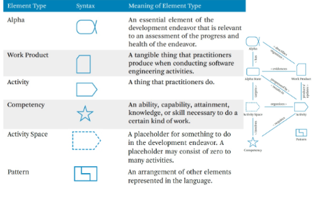
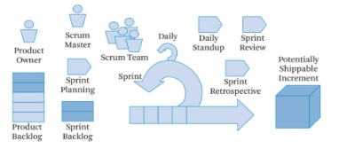
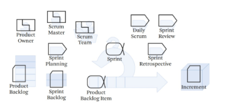

## Modulo 1
1. Quali sono le diverse categorie di software?

**Risposta:** Le diverse categorie di software sono: ecosistemi software, softare sociali, software embdded e servizi software.

2. Cos’è un software, e quali sono i tipi di prodotto software?

**Risposta:** Il software è un prodotto di ingegno costituito da una serie di istruzioni che vengono eseguite da un computer per svolgere una determinata funzione. I tipi di prodotto software sono: software generico(venduto sul mercato), commissionato, in sviluppo perpetuo(commissionato e mantenuto).

3. Requisito vs Feature?

**Risposta:** Un requisito è una funzionalità o un vincolo che il sistema software deve soddisfare, richiesto da un cliente o da un utente. Una feature è una funzionalità che il sistema software offre, implementata dal team di sviluppo.

4. Autore vs Compratore dal punto di vista legale?

**Risposta:** L'autore di un software è protetto dai diritti d'autore e ha il diritto di decidere come il software può essere utilizzato. Il compratore non ha garanzia sul prodotto acquistato. La SIAE tutela i diritti d'autore.

5. Come si calcola la produttività?

**Risposta:** La produttività si calcola dividendo l'output prodotto dal sistema software per le risorse impiegate per produrlo. 

6. Perché falliscono i progetti software?

**Risposta:** I progetti software possono fallire per diversi motivi, tra cui: requisiti mal definiti, turnover dello staff, etc.

7. Ciclo di sviluppo vs ciclo di vita?

**Risposta:** Il ciclo di sviluppo è il processo di sviluppo di un sistema software, che comprende le attività di analisi, progettazione, prototipazione, testing e rilascio. Il ciclo di vita, invece, comprende raccolta dei requisiti, progettazione, codifica, debugging, testing, deployment e manutenzione.

8. Costi e processo di sviluppo?

**Risposta:** Il costo dle processo software è dominato dal costo di mantenimento.

9. Legge di Brooks?

**Risposta:** La legge di Brooks afferma che aggiungere personale a un progetto software in ritardo lo farà solo ritardare ulteriormente. Questo perché il personale aggiuntivo deve essere formato e integrato nel team esistente, il che richiede tempo e risorse.

10. Legge di Conway?

**Risposta:** La legge di Conway afferma che le organizzazioni tendono a produrre sistemi software che riflettono la struttura delle organizzazioni stesse. 

11. Software come prodotto sociale?

**Risposta:** Il software è un prodotto sociale perché coinvolge persone che lavorano insieme per sviluppare un sistema software. Il software è influenzato dalle interazioni sociali tra le persone coinvolte nel processo di sviluppo e può avere un impatto sulla società in generale.

12. Categorie di processi: programming in the many, in the small, in the large?

**Risposta:** Programming in the many è il processo di sviluppo di software in cui più persone lavorano insieme su un progetto. Programming in the small è il processo di sviluppo di software in cui una singola persona lavora su un progetto. Programming in the large è il processo di sviluppo di software in cui una persona lavora su più progetti.

13. Modello a cascata?

**Risposta:** Il modello a cascata è un modello di sviluppo software in cui le attività di sviluppo sono suddivise in fasi sequenziali, in cui ogni fase deve essere completata prima di passare alla successiva. Le fasi del modello a cascata sono: analisi dei requisiti, progettazione, implementazione, test e manutenzione.

14. Modelli generici di processo software?

**Risposta:** I modelli generici di processo software sono modelli che descrivono le attività coinvolte nello sviluppo di software. Alcuni esempi di modelli generici di processo software sono il modello a cascata, il modello iterativo, agile e a spirale.

15. Modello lineare vs iterativo?

**Risposta:** Il modello lineare prevede che le attività di sviluppo siano svolte in modo sequenziale, mentre il modello iterativo prevede che le attività di sviluppo siano svolte in modo iterativo e incrementale. Il secondo permette maggior adattabilità ai cambiamenti dei requisiti.

16. Modello a spirale?

**Risposta:** Il modello a spirale prevende la suddivisione del processo di sviluppo in 4 fasi: determinazione degli obiettivi, analisi dei rischi, sviluppo e valutazione. Il modello a spirale è iterativo e incrementale, il che significa che il processo di sviluppo viene ripetuto più volte fino a quando il prodotto software non è completato.

17. Qualità del processo software?

**Risposta:** La qualità del processo software è misurata su basi di: visibilità(regole e artefatti noti agli stakeholders), misurabilità, precisione e ripetibilità.

18. Principi agili e etica del movimento?

**Risposta:** I principi agili sono un insieme di principi che guidano lo sviluppo di software agile. Alcuni principi agili sono: individui e interazioni più che processi e strumenti, software funzionante più che documentazione esaustiva, collaborazione con il cliente più che negoziazione dei contratti, rispondere al cambiamento più che seguire un piano.   

19. MVP?

**Risposta:** Il Minimum Viable Product (MVP) è la versione più semplice di un prodotto software che contiene solo le funzionalità essenziali per soddisfare i bisogni dei clienti. L'MVP viene rilasciato il prima possibile per ottenere feedback dai clienti e migliorare il prodotto.

20. XP e pratiche?

**Risposta:** Extreme Programming (XP) è una metodologia di sviluppo software agile che si basa su una serie di pratiche di sviluppo software. Alcune pratiche di XP sono: Pair Programming, Test-Driven Development, Continuous Integration, etc.

21. US?

**Risposta:** Le User Stories sono brevi descrizioni di una funzionalità o di un requisito del sistema software, scritte dal punto di vista dell'utente. Sono scritte in forma di "As a [user], I want [feature], so that [benefit]". Per determinare la priorità delle User Stories si utilizza il metodo MoSCoW: Must have, Should have, Could have, Won't have.

22. Ciclo base di Scrum?

**Risposta:** Il ciclo base di Scrum è composto da tre fasi: sprint planning, sprint e sprint review. Dopo che arriva l'idea, il PO crea una lista id funzionalità(product backlog), il team di sviluppo seleziona le funzionalità da sviluppare(sprint backlog), il team di sviluppo sviluppa le funzionalità durante lo sprint e alla fine del sprint il team di sviluppo presenta il lavoro completato al PO e agli stakeholder(sprint review), assieme ad una demo del prodotto software. Alla fine del ciclo si tiene una sprint retrospective per riflettere sul lavoro svolto e identificare i punti di forza e di debolezza del processo di sviluppo.   

23. Sprint?

**Risposta:** Uno sprint è un periodo di tempo fisso, di solito di 2-4 settimane, durante il quale il team di sviluppo lavora per completare un insieme di User Stories. Gli sprint sono utilizzati in Scrum per organizzare il lavoro e garantire che il team di sviluppo possa concentrarsi su un insieme limitato di attività per un periodo di tempo definito.

24. Ruoli Scrum?

**Risposta:** I ruoli di Scrum sono: Product Owner, Scrum Master e Team di Sviluppo. Il Product Owner è responsabile della definizione e della priorizzazione dei requisiti del sistema software. Il Scrum Master è responsabile di facilitare il processo di sviluppo e di rimuovere gli ostacoli che impediscono al team di sviluppo di lavorare in modo efficiente. Il Team di Sviluppo è responsabile dello sviluppo del sistema software e della consegna delle funzionalità richieste.

25. Sprint planning?

**Risposta:** Lo sprint planning è una riunione che si tiene all'inizio di ogni sprint in cui il team di sviluppo pianifica il lavoro da svolgere durante lo sprint. Durante lo sprint planning, il team di sviluppo seleziona le User Stories da sviluppare durante lo sprint e le stima il tempo necessario per completarle.

26. Definition of ready e done?

**Risposta:** La Definition of Ready è un insieme di criteri che devono essere soddisfatti prima che una User Story possa essere presa in considerazione per lo sviluppo. La Definition of Done è un insieme di criteri che devono essere soddisfatti prima che una User Story possa essere considerata completata.

27. Daily Scrum?

**Risposta:** Il Daily Scrum è una riunione giornaliera che si tiene durante lo sprint in cui il team di sviluppo si riunisce per discutere il lavoro svolto, i problemi riscontrati e i piani per il giorno successivo. Il Daily Scrum è un'occasione per il team di sviluppo di sincronizzarsi e di identificare eventuali ostacoli che potrebbero rallentare lo sviluppo del progetto.

28. Sprint review?

**Risposta:** La sprint review è una riunione che si tiene alla fine di ogni sprint in cui il team di sviluppo presenta il lavoro completato al Product Owner e agli stakeholder. Durante la sprint review, il team di sviluppo discute i risultati della sprint e riceve feedback sul lavoro svolto.

29. Sprint retrospective?

**Risposta:** La sprint retrospective è una riunione che si tiene alla fine di ogni sprint in cui il team di sviluppo riflette sul lavoro svolto e identifica i punti di forza e di debolezza del processo di sviluppo. Durante la sprint retrospective, il team di sviluppo discute i problemi riscontrati durante la sprint e cerca di trovare soluzioni per migliorare il processo di sviluppo.

30. Artefatti?

**Risposta:** Gli artefatti di Scrum sono i documenti, i diagrammi e le informazioni che vengono prodotti durante lo sviluppo di un progetto software. Alcuni esempi di artefatti di Scrum sono il product backlog, lo sprint backlog e il burndown chart.

31. Product backlog?

**Risposta:** Il product backlog è una lista di tutte le funzionalità, i requisiti e le attività che devono essere completate per un progetto software. Il product backlog è dinamico e può essere modificato in qualsiasi momento durante lo sviluppo del progetto. Viene creato dal Product Owner e gestito dal team di sviluppo. $\\$
In Agile è un insieme di User Stories con assegnati valori e stime. In cima al backlog ci sono le User Stories più importanti e urgenti.

32. Varianti di Scrum?

**Risposta:** Alcune varianti di Scrum sono: Scrum of Scrums(meta scrum), team multipli che lavorano su un singolo prodotto, team unico con più Product Owner.

33. Legge di Humphrey?

**Risposta:** La legge di Humphrey afferma che i requisiti di un sistema software non sono chiari finché non sono stati testati. 

34. Requisito e forma del requisito?

**Risposta:** Il requisito può essere: di business(il programma non esiste), utente(gli utente lo useranno), software(il programma deve fare qualcosa). Il requisito può essere espresso in forma di User Story, Use Case, Epica o requisito funzionale

35. Competenze del PO?

**Risposta:** Il Product Owner è responsabile della definizione e della priorizzazione dei requisiti del sistema software. Il Product Owner deifnire il product goal, il product backlog, assegna le priorità alle User Stories e concorda le definizioni di done e ready con il team di sviluppo. 

36. Stakeholders?

**Risposta:** Gli stakeholders sono le persone o le organizzazioni che sono coinvolte o interessate a un progetto software. Gli stakeholders possono essere interni o esterni al progetto e possono avere un impatto sulle decisioni prese durante lo sviluppo del progetto.

37. Backlog?

**Risposta:** Il backlog è una lista di tutte le funzionalità, i requisiti e le attività che devono essere completate per un progetto software. Il backlog è dinamico e può essere modificato in qualsiasi momento durante lo sviluppo del progetto. 

38. Retrospettiva, ruoli coinvolti?

**Risposta:** La retrospettiva è una riunione che si tiene alla fine di ogni sprint in cui il team di sviluppo riflette sul lavoro svolto e identifica i punti di forza e di debolezza del processo di sviluppo. I ruoli coinvolti nella retrospettiva sono il Product Owner, il Team di Sviluppo e il Scrum Master.

39. Essence?

**Risposta:** Essence è un framework di sviluppo software che fornisce un insieme di pratiche e strumenti per migliorare la qualità e la produttività del processo di sviluppo software. Essence si basa su un insieme di kernel e alfa che rappresentano le attività e le competenze coinvolte nello sviluppo di un sistema software.$\\$

Scrum definito con Essence: $\\$

40. Giochi di retrospettiva?

**Risposta:** Progress poker: si scelgono delle carte alpha, si dà una valutazione di progresso e se la valutazione differisce si argomenta col team il motivo. Chase the state: si disegna una linea del tempo e si mettono i progressi. Good Mad Sad: si scrivono le cose buone, cattive e tristi, annotando come migliorare. 

41. Principi INVEST?

**Risposta:** I principi INVEST sono un insieme di principi che guidano la scrittura di User Stories efficaci. I principi INVEST sono: Independent, Negotiable, Valuable, Estimable, Small e Testable.

42. US orizzontali e verticali?

**Risposta:** Le User Stories orizzontali vengono utilizzate se si vogliono riutilizzare specifiche dei piani inferiori. Le User Stories verticali si utilizzano se per impacchettare funzionalità senza dipendenze e consegnarle più in fretta per avere un feedback anticipato.

43. Requisiti?

**Risposta:** I documenti dei requisiti sono User Stories, Use Cases, Prototipi e Mockup.

44. Casi d’uso vs US?

**Risposta:** I casi d'uso e le User Stories sono entrambi strumenti utilizzati per descrivere i requisiti di un sistema software. I casi d'uso sono diagrammi che descrivono le interazioni tra un attore e il sistema software, mentre le User Stories sono brevi descrizioni di una funzionalità o di un requisito del sistema software, scritte dal punto di vista dell'utente.

45. Tipi di attori?

**Risposta:** Nei diagrammi dei casi d'uso, gli attori sono rappresentati da figure esterne al sistema, Gli attori pososno essere di business, se sono indipedenti da soluzioni software, o di sistema, se sono dipendenti da soluzioni software. In questo per soluzioni software si intende il sistema software che si sta sviluppando.

46. Project manager?

**Risposta:** Il Project Manager è la persona responsabile della pianificazione, dell'organizzazione e del coordinamento di un progetto software. Verifica che il progetto sia completato entro i tempi e i costi previsti e che soddisfi i requisiti specificati. Confronta alla fine preventivo e consuntivo.

47. Work breakdown Taiga?

**Risposta:** Il Work Breakdown Structure (WBS) è una struttura gerarchica che suddivide il lavoro di un progetto in attività più piccole e gestibili. Taiga è uno strumento di project management che consente di creare e gestire il WBS di un progetto software.

48. Cono delle incertezze?

**Risposta:** Il cono delle incertezze è un modello che rappresenta il livello di incertezza di un progetto software nel corso del tempo.

49. Valore, produttività, costo, debito tecnico?

**Risposta:** Il valore di un progetto software è dato dal numeri di utenti moltiplicato per i ricavi per utente. La produttività è il rapporto tra output e risorse impiegate. Il costo è il denaro speso per produrre il software. Il debito tecnico è il costo di correggere i difetti e i problemi di un sistema software. In un buon progetto il valore è maggiore del costo sommato al debito tecnico.

50. Misure di dimensioni del progetto?

**Risposta:** Le misure di dimensione del progetto sono metriche software che misurano la dimensione di un sistema software in base a diversi fattori, tra cui il numero di linee di codice, il numero di funzionalità e il numero di requisiti. Alcune misure di dimensione del progetto sono: Linee di Codice (LoC), Function Points (FP) e Story Points (SP).

51. LoC?

**Risposta:** Le Linee di Codice (LoC) sono una metrica software che misura la dimensione di un sistema software in base al numero di linee di codice sorgente. Le LoC sono utilizzate per valutare la complessità e la dimensione di un sistema software.

52. FP?

**Risposta:** I Function Points sono una metrica software che misura la dimensione di un sistema software in base alle funzionalità che offre. I Function Points sono calcolati in base al numero di input, output, file logici, interrogazioni e interfacce utente di un sistema software.

53. COCOMO?

**Risposta:** Il COCOMO è un modello di stima dei costi di sviluppo del software. Si basa su 3 livelli: basic(inizio del progetto), intermediate(dopo la specifica dei requisiti), advanced(dopo la progettazione). Ci possono essere 3 tipi di progetti: organici(team piccolo), semi-detached(team medio), embedded(requisiti vincolanti in campo poco conosciuto). L'equazione è: `performance = complexity^process * team * tools`.

54. Bug?

**Risposta:** Un bug è un difetto o un errore in un sistema software che causa un comportamento indesiderato o un malfunzionamento del sistema. 

55. Qualità del prodotto software?

**Risposta:** La qualità del prodotto software è la misura in cui un sistema software soddisfa i requisiti specificati e le aspettative degli utenti. La qualità del prodotto software può essere valutata in base a diversi fattori, tra cui la correttezza, l'affidabilità, l'efficienza, la manutenibilità e l'usabilità.

56. Tom DeMarco?

**Risposta:** Tom DeMarco dice che non si può controllare ciò che non si può misurare. Questo significa che per migliorare la qualità di un sistema software è necessario misurare le prestazioni e le caratteristiche del sistema software e utilizzare queste informazioni per prendere decisioni informate sul processo di sviluppo.

57. Goal Question Metric?

**Risposta:** E' un metodo per definire metriche software che misurano il raggiungimento degli obiettivi di un progetto software. Il metodo Goal Question Metric prevede di identificare gli obiettivi del progetto, formulare domande che misurano il raggiungimento di tali obiettivi e definire metriche che rispondono a tali domande.

58. Testing?

**Risposta:** Il testing è il processo di valutazione di un sistema software per determinare se soddisfa i requisiti specificati e per identificare eventuali difetti. Esistono diversi tipi di testing: di unità, di modulo(componenti correlate), di sottosistem(insiemi di moduli), di sistema e di accettazione.

59. Metodi di testing?

**Risposta:** I testing sono diretti, se di basso livello che controllano funzionalità di base o indiretti, di solito manuale, di alto livello che controllano casi specifici.

60. Black box vs white box?

**Risposta:** Il testing black box è un tipo di testing in cui il tester non ha conoscenza del codice sorgente del sistema software e si concentra sulle funzionalità e sui requisiti del sistema. Il testing white box è un tipo di testing in cui il tester ha conoscenza del codice sorgente del sistema software e si concentra sulla struttura interna del sistema.

61. Teorema di Weyuker?

**Risposta:** Il teorema di Weyuker afferma che non esiste un metodo di testing che possa rilevare tutti i difetti di un sistema software. Questo perché il numero di possibili input e output di un sistema software è infinito, il che rende impossibile testare tutti i casi possibili.

62. Sviluppo guidato dal testing?

**Risposta:** Il Development Driven Testing (TDD) è una pratica di sviluppo software che prevede di scrivere i test prima di scrivere il codice sorgente del sistema software. Questo permette di garantire che il codice sorgente soddisfi i requisiti specificati e che i difetti vengano identificati e corretti prima che il sistema software venga rilasciato.

63. Fault injection?

**Risposta:** La fault injection è una tecnica di testing che consiste nell'introdurre errori o difetti in un sistema software per valutare la sua capacità di gestirli e recuperare da essi.

64. SonarQube?

**Risposta:** SonarQube è uno strumento di analisi statica del codice sorgente che permette di identificare e correggere i difetti e le vulnerabilità del sistema software. 

65. Evoluzione del software?

**Risposta:** L'evoluzione del software è il processo di sviluppo continuo di un sistema software per adattarlo ai cambiamenti dei requisiti e delle tecnologie. 

66. Tipi di manutenzione?

**Risposta:** I tipi di manutenzione del software sono: preventiva(prevenire i guasti), correttiva(correggere i guasti), adattativa(adattare il software a nuovi ambienti), perfettiva(migliorare le prestazioni) e di emergenza(risolvere problemi critici).

67. Complessità ciclomatica?

**Risposta:** La complessità ciclomatica è una metrica software che misura il numero di cammini indipendenti attraverso il codice sorgente di un programma. Un valore elevato di complessità ciclomatica indica che il codice sorgente è difficile da comprendere e da mantenere.

68. Metriche di manutenibilità?

**Risposta:** Le metriche di manutenibilità sono metriche software che misurano la facilità con cui un sistema software può essere modificato, corretto o esteso. La manutebilità interna è la facilità con cui il codice sorgente di un sistema software può essere compreso e modificato. La manutenibilità esterna è la facilità con cui un sistema software può essere esteso o integrato con altri sistemi software.

## Domande da rifare

# Modulo 1

11. Legge di Conway?
13. Modello a cascata?
16. Modello a spirale?
18. Principi agili e etica del movimento?
21. US?
22. Ciclo base di Scrum?
23. Sprint?
24. Ruoli Scrum?
26. Definition of ready e done?
35. Competenze del PO?
36. Stakeholders?
39. Essence?
41. Principi INVEST?
42. US orizzontali e verticali?
44. Casi d’uso vs US?
45. Tipi di attori?
47. Work breakdown Taiga?
49. Valore, produttività, costo, debito tecnico?
52. FP?
53. COCOMO?
56. Tom DeMarco?
57. Goal Question Metric?
59. Metodi di testing?
60. Black box vs white box?
61. Teorema di Weyuker?
64. SonarQube?
66. Tipi di manutenzione?
67. Complessità ciclomatica?
68. Metriche di manutenibilità?