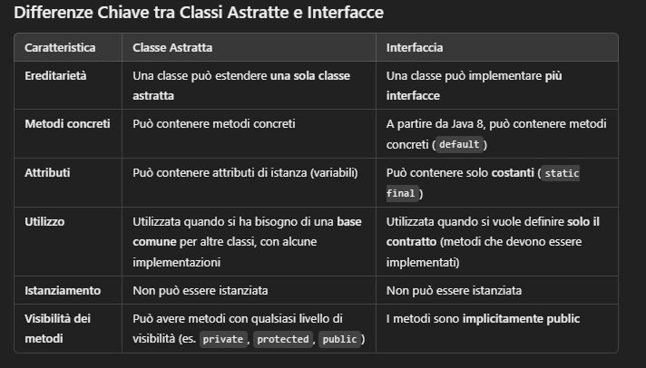

## Modulo 2
1. Moduli: coupling, coesione, semplicità?

**Risposta:** Il coupling è il grado di dipendenza tra i moduli, un coupling basso è preferibile. La coesione è il grado di correlazione tra le funzionalità di un modulo, una coesione alta è preferibile. La semplicità è la facilità di comprensione di un modulo, una semplicità alta è preferibile.

2. UML?

**Risposta:** UML (Unified Modeling Language) è un linguaggio di modellazione standard per descrivere, progettare e documentare sistemi software. Si divide in due categorie: diagrammi strutturali e diagrammi comportamentali.

3. Classi?

**Risposta:** Una classe è un modello astratto di un oggetto che rappresenta un insieme di attributi e metodi. 

4. 13 tipi di diagrammi?

**Risposta:** Si dividono in diagrammi strutturali e diagrammi comportamentali. 

5. OO concept modeling, OO analysis?

**Risposta:** L'OO concept modeling è il processo di identificazione e definizione dei concetti chiave di un sistema. L'OO analysis è il processo di analisi dei requisiti di un sistema per identificare i concetti chiave e le relazioni tra di essi.

6. Ereditarietà virtuale?

**Risposta:** L'ereditarietà virtuale è un tipo di ereditarietà in cui una classe base ha un metodo virtuale puro, che deve essere implementato dalle classi derivate.$\\$
E' correlata all'ereditarietà multipla, in cui una classe deriva da più classi base. In C++ si risolve con l'ereditarietà virtuale, in Java si risolve con l'interfaccia.


```C++
class A {
    virtual void f(){
        cout << "A";
    }
};

class B : public A {
    void f(){
        cout << "B";
    }
};

class C : public A {
    void f(){
        cout << "C";
    }
};

class D : public B, public C {
    void f(){
        B::f();
        C::f();
    }
};
```

In questo esempio, `A` è una classe base con un metodo virtuale puro `f()`, che serve come interfaccia. `B` e `C` sono classi derivate che implementano `f()`. `D` è una classe che eredita da `B` e `C`, che ereditano da `A`. L'ereditarietà virtuale evita l'ambiguità dell'ereditarietà multipla. Quindi, `D` eredita solo una copia di `A`. 

```Java
interface A {
    void f();
}

class B implements A {
    void f() {}
}

class C implements A {
    void f() {}
}

class D extends B, C {
    // D eredita da B e C, che implementano A
}
```


7. OOA to OOD?

**Risposta:** L'OOA (Object-Oriented Analysis) è il processo di analisi dei requisiti di un sistema per identificare i concetti chiave e le relazioni tra di essi. L'OOD (Object-Oriented Design) è il processo di progettazione di un sistema in termini di classi e oggetti.

8. Livelli di specificazione?

**Risposta:** I livelli di specificazione sono: concettuale, specifica e implementativa.Il livello concettuale è il più alto, descrive il sistema in modo astratto. Il livello specifica è il livello intermedio, descrive il sistema in modo dettagliato. Il livello implementativo è il livello più basso, descrive il sistema in modo concreto.

9. Class diagram?

**Risposta:** Il diagramma delle classi è un diagramma UML che rappresenta le classi di un sistema e le relazioni tra di esse.

10. Use case diagram?

**Risposta:** Il diagramma dei casi d'uso è un diagramma UML che rappresenta le interazioni tra un sistema e i suoi attori. 

11. Statechart diagram?

**Risposta:** Il diagramma degli stati è un diagramma UML che rappresenta il comportamento di un oggetto in base al suo stato.

12. Activity diagram?

**Risposta:** Il diagramma delle attività è un diagramma UML che rappresenta il flusso di controllo tra attività in un sistema.

13. Sequence diagram?

**Risposta:** Il diagramma di sequenza è un diagramma UML che mostra l'interazione tra oggetti in una sequenza temporale.

14. Collaboration diagram?

**Risposta:** Il diagramma di collaborazione è un diagramma UML che mostra le interazioni tra gli oggetti.

15. Package diagram?

**Risposta:** Il diagramma dei package è un diagramma UML che mostra la struttura di un sistema in termini di package.

16. Components diagram?

**Risposta:** Il diagramma dei componenti è un diagramma UML che mostra i componenti di un sistema e le relazioni tra di essi.

17. System e sub-system?

**Risposta:** E' buona pratica nel design di un sistema suddividerlo in sottosistemi o componenti per facilitarne la comprensione e la manutenzione.

18. Real time system analysis and design?

**Risposta:** L'analisi e il design dei sistemi real-time si concentrano sulla gestione del tempo e delle risorse in un sistema che deve rispondere a vincoli temporali specifici. Specificano due tipi di vincoli temporali: i Time events(eventi che si verificano in un momento specifico) e i Time constraints(vincoli temporali che devono essere rispettati).

19. ROOM?

**Risposta:** ROOM (Real-time Object-Oriented Modeling) è un linguaggio di modellazione per sistemi real-time basato su UML.

20. OCL?

**Risposta:** OCL (Object Constraint Language) è un linguaggio di specifica per esprimere vincoli su modelli UML. Immette l'uso di condizioni logiche pre e post statement per definire i vincoli(se mangio una pizza, allora peserò di più).

21. Refactoring?

**Risposta:** Il refactoring è il processo di ristrutturazione del codice senza modificarne il comportamento esterno.

22. Approccio gamma?

**Risposta:** L'approccio gamma è un approccio al design basato su pattern.

23. Garland and Shaw?

**Risposta:** Garland and Shaw hanno identificato 7 tipi di architetture software: pipes e filtri, ADT, layered system, event-based implicit invocation, repositories, interpreters, repository centrale.

24. Pipes e filtri?

**Risposta:** L'architettura a pipes e filtri è un'architettura in cui i dati passano attraverso una serie di filtri che li trasformano. I filtri sono indipendenti e possono essere riutilizzati.

25. ADT?

**Risposta:** L'architettura ADT(Abstract Data Type) è un'architettura in cui i dati sono incapsulati in un'interfaccia ben definita. I dati sono l'unità di base del sistema. Sono indipendenti dall'implementazione.

27. Event-based implicit invocation?

**Risposta:** L'architettura event-based implicit invocation è un'architettura in cui i nodi comunicano tra loro attraverso eventi. Un modulo invia un evento a tutti gli altri moduli che lo sanno gestire.

28. Repositories?

**Risposta:** Un repository è un'architettura in cui un repository centrale contiene tutti i dati e i moduli del sistema. I moduli comunicano tra loro attraverso il repository centrale.

29. Interpreters?

**Risposta:** L'interprete è un programma che legge un programma sorgente e lo esegue. L'interprete è un'architettura in cui un interprete legge un programma sorgente e lo esegue.

30. Repository centrale?

**Risposta:** L'architettura a repository centrale è un'architettura in cui un repository centrale contiene tutti i dati e i moduli del sistema. I moduli comunicano tra loro attraverso il repository centrale.

31. Client-server?

**Risposta:** L'architettura client-server è un'architettura in cui un nodo(client) richiede un servizio a un altro nodo(server). Il server fornisce il servizio richiesto e il client lo utilizza.

32. Inter/intra net?

**Risposta:** Una intranet è una rete privata che utilizza tecnologie internet per condividere informazioni all'interno di un'organizzazione. Una internet è una rete pubblica che collega le reti intranet.

33. N tiers architectures?

**Risposta:** Le architetture a N livelli sono architetture in cui il sistema è diviso in N livelli o strati. Ogni strato ha un'interfaccia ben definita e comunica solo con i livelli adiacenti. 

34. Layered architecture?

**Risposta:** L'architettura a strati è un'architettura in cui il sistema è diviso in strati o livelli. Ogni strato ha un'interfaccia ben definita e comunica solo con i livelli adiacenti. I livelli più alti sono più astratti e i livelli più bassi sono più concreti. I livelli più interni non conoscono i livelli più esterni.

35. Network architecture?

**Risposta:** L'architettura Network è un'architettura in cui i nodi comunicano tra loro attraverso una rete.

36. Architettura parallela?

**Risposta:** Un'architettura parallela è un'architettura in cui i calcoli sono eseguiti in parallelo su più processori.

37. Grid computing?

**Risposta:** Grid computing è un'architettura parallela in cui i calcoli sono distribuiti su una rete di computer.

38. Controllo centralizzato?

**Risposta:** Il controllo centralizzato è un'architettura in cui un singolo nodo controlla tutti gli altri nodi. Ci sono due tipi di controllo centralizzato: *call-return*, dove il nodo principale chiama iterativamente gli altri nodi finché non ha ottenuto il risultato, e *manager-module*, dove il nodo principale controlla start, stop e scheduling degli altri nodi attraverso un loop.

39. Event driven control?

**Risposta:** L'event-driven control è un'architettura in cui i nodi comunicano tra loro attraverso eventi. Ci sono due tipi di event-driven control: *broadcast*, dove un nodo invia un evento a tutti gli altri nodi che lo sanno gestire, e *interrupt-driven*, per i sistemi real-time, dove un nodo invia un evento a un altro nodo che lo sa gestire.

40. Multi-thread processing?

**Risposta:** Il multi-thread processing è un'architettura in cui un sistema è diviso in più thread che possono essere eseguiti in parallelo.

41. Decomposizione modulare?

**Risposta:** La decomposizione modulare è il processo di suddivisione di un sistema in moduli o componenti separati. Il design top-down parte dall'intero sistema e lo suddivide in moduli, mentre il design bottom-up parte dai moduli e li assembla in un sistema completo.

42. Data flow model?

**Risposta:** Il modello di flusso dei dati è un modello di sviluppo software basato tu pipes e filtri. I dati passano attraverso una serie di filtri che li trasformano. I dati sono l'unità di base del sistema.

43. OO model?

**Risposta:** Il modello OO è un modello di sviluppo software basato su oggetti. Gli oggetti sono l'unità di base del sistema. Utilizza concetti di ereditarietà, incapsulamento(nascondere i dettagli di implementazione), polimorfismo e astrazione.

44. Procedural and data abstraction?

**Risposta:** L'astrazione procedurale è il processo di nascondere i dettagli di implementazione di un'operazione. L'astrazione dei dati è il processo di nascondere i dettagli di implementazione dei dati.

45. RTTI in C vs in Java?

**Risposta:** RTTI(Runtime Type Information) è una funzionalità che permette di ottenere informazioni sul tipo di un oggetto a runtime. In C++ ha due features: type-safe downcasting, `dynamic_cast<D*>(bp)` o `dynamic_cast<D&>(bp)`(ritorna `bp` convertito nel tipo `D`), e type identification, `typeid(bp)`(ritorna un oggetto `type_info` che contiene informazioni sul tipo di `bp`). In Java gli RTTI sono di due tipi: reflection(è più una libreria che un RTTI), permette di ottenere informazioni sulle classi a runtime e di invocare metodi dinamicamente, e `instanceof`, permette di verificare se un oggetto è di un certo tipo.

46. Error handling?

**Risposta:** Un buon codice dev'essere fault aware, fault tolerant e deve avere falt recovery. Prima dei linguaggi OO si ritornavano messaggi di errore, ma con l'OO si è passati alle eccezioni. 

47. Exception?

**Risposta:** Un'eccezione è un oggetto che rappresenta un errore o un comportamento che non appartiene al flusso normale del programma. Le eccezioni vengono lanciate per segnalare un errore: `throw object` in C++, `throw reference_to_object` in Java. In C++ `void f() throw(T1, T2)` vengono controllate solo eccezioni dei tipi `T1` e `T2`, altrimenti a runtime si utilizza la libreria standard `std::unexpected()`. In Java `void f() throws T1, T2` dichiara che qualsiasi eccezione è catturata a compilazione a parte quelle dei tipi `T1` e `T2`, però si controlla sia presente del codice che gestisce queste eccezioni.

48. Try-catch?

**Risposta:** Il blocco `try-catch` è un blocco di codice che permette di gestire le eccezioni. Il codice che potrebbe lanciare un'eccezione va dentro il blocco `try`, mentre il codice che gestisce l'eccezione va dentro il blocco `catch`, potrebbe contenere `finally` per eseguire del codice in ogni caso. Il `finally` viene eseguito subito dopo il `catch` se l'eccezione è gestita altrimenti prima di fare stack unwinding. Lo stack unwinding è il processo di rimozione degli oggetti nello stack fino a trovare un exception handler che matcha il tipo di erorre. Il processo di ricerca di un dynamically enclosed scope è chiamato exception propagation.

49. Java exceptions?

**Risposta:** In Java le eccezioni sono tutte di tipo `Throwable`, che ha due sottotipi: `Error` e `Exception`. Ci sono due tipi di eccezioni: checked e unchecked. Le checked devono essere gestite a compilazione, altrimenti il codice non compila e sono sottotipo di `Exception`. Le unchecked non devono essere gestite a compilazione e sono sottotipo di `Error` e `RuntimeException`.  

## Domande da rifare


# Modulo 2

6. Ereditarietà virtuale?
8. Livelli di specificazione?
9. Class diagram?
10. Use case diagram?
11. Statechart diagram?
12. Activity diagram?
13. Sequence diagram?
14. Collaboration diagram?
15. Package diagram?
16. Components diagram?
18. Real time system analysis and design?(da guardare anche gli esempi)
19. ROOM? 
20. OCL?
24. Pipes e filtri?
25. ADT?
27. Event-based implicit invocation?
28. Repositories?
29. Interpreters?
30. Repository centrale?
31. Client-server?
32. Inter/intra net?
33. N tiers architectures?
34. Layered architecture?
35. Network architecture?
36. Architettura parallela?
37. Grid computing?
38. Controllo centralizzato?
39. Event driven control?
42. Data flow model?
43. OO model?
44. Procedural and data abstraction?
45. RTTI in C vs in Java?
47. Exception?
48. Try-catch?
49. Java exceptions?
50. OO concept modeling, OO analysis, OO design?
